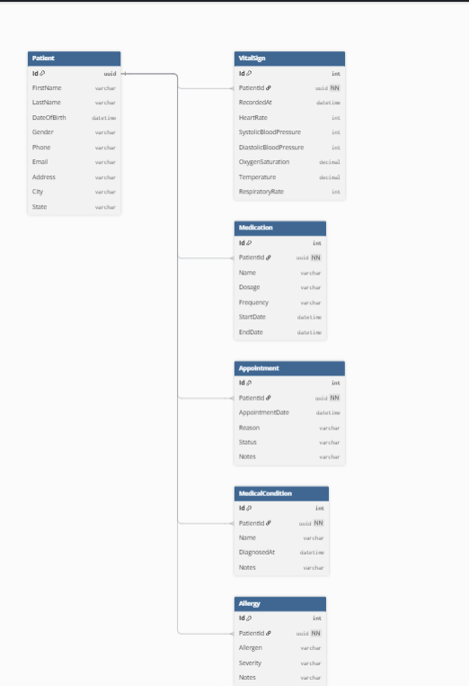

# Week 6 — Day 1

## Sprint 1 Planning & Project Database Design

### Sprint Goal

Improve the existing Cardiac Patient Monitoring System by adding efficient API read operations while keeping the existing database and core API.

## Sprint 1 Backlog

| # | Task                                                      | Estimated Time | Status  |
| - | --------------------------------------------------------- | -------------: | ------- |
| 1 | Review existing database schema and EF Core relationships |             2h | Done    |
| 2 | Finalize and document database ERD                        |             2h | Done    |
| 3 | Implement pagination for patient data                     |             3h | Pending |
| 4 | Implement filtering for patient data                      |             3h | Pending |
| 5 | Implement sorting for patient data                        |             2h | Pending |
| 6 | Implement DTO projection                                  |             2h | Pending |
| 7 | Test API functionality using Swagger                      |             2h | Pending |
| 8 | Update documentation and verify build                     |             1h | Pending |

## Domain Entities

* Patient
* VitalSign
* Medication
* Appointment
* MedicalCondition
* Allergy
* IdentityUser

## Database ERD

The existing database schema was reviewed and the ERD was finalized based on the EF Core model.

**ERD:**

### Main Relationships

* Patient → VitalSigns
* Patient → Medications
* Patient → Appointments
* Patient → MedicalConditions
* Patient → Allergies

## Database Design

The database uses separate tables for patient, medical, and appointment data to reduce duplication and keep the data organized.

The existing EF Core `DbContext` configures the relationships and foreign keys between `Patient` and the related entities.

## Sprint 1 Task Sizing

| Task                               | Size     |
| ---------------------------------- | -------- |
| Database Review & ERD              | Half Day |
| Pagination                         | Half Day |
| Filtering                          | Half Day |
| Sorting                            | Half Day |
| DTO Projection                     | Half Day |
| API Testing                        | Half Day |
| Documentation & Build Verification | Half Day |
