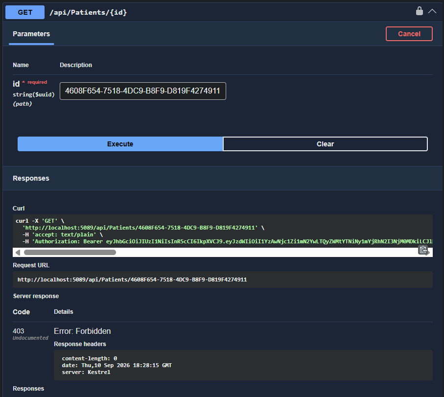

# Week 7 — Day 3: Role-Based Access Control

## Overview

Day 3 focused on implementing **Role-Based Access Control (RBAC)** and **resource-based authorization** in the Cardiac Patient Monitoring API.

The main goal was to control which endpoints each role can access and make sure a Patient can only access their own data.

---

## Roles

The project uses two roles:

* **Patient** — assigned automatically when a new patient registers.
* **Admin** — assigned separately through the existing seeded admin account.

The role assignment is handled through ASP.NET Core Identity.

[View IdentitySeeder.cs](./CardiacPatientMonitoring/CardiacPatientMonitoring.Api/Data/IdentitySeeder.cs)

---

## Authorization Approach

Two types of authorization were implemented:

### 1. Role-Based Authorization

Role-based authorization checks whether the logged-in user has the required role.

For example, getting all patients is an **Admin-only** endpoint:

[View PatientsController.cs](./CardiacPatientMonitoring/CardiacPatientMonitoring.Api/Controllers/PatientsController.cs)

```csharp
[Authorize(Roles = "Admin")]

[HttpGet]

public async Task<ActionResult<IEnumerable<PatientResponse>>> GetPatients()
```

A Patient token cannot access this endpoint and receives **403 Forbidden**.

### 2. Resource-Based Authorization

Role checking alone is not enough when a Patient accesses a specific record.

The API also checks the `patientId` claim from the JWT and compares it with the Patient ID of the requested resource.

If the requested record belongs to another patient, the API returns **403 Forbidden**.

This ownership check was applied to the endpoints that allow Patients to access their own records.

---

## Endpoint Authorization

### Patients

| Endpoint         | Access                |
| ---------------- | --------------------- |
| GET all patients | Admin                 |
| GET one patient  | Admin or same Patient |
| POST patient     | Admin                 |
| PUT patient      | Admin or same Patient |
| DELETE patient   | Admin                 |

[View PatientsController.cs](./CardiacPatientMonitoring/CardiacPatientMonitoring.Api/Controllers/PatientsController.cs)

---

### Appointments

| Endpoint             | Access                |
| -------------------- | --------------------- |
| GET all appointments | Admin                 |
| GET one appointment  | Admin or owner        |
| GET by patient ID    | Admin or same Patient |
| POST appointment     | Admin or same Patient |
| PUT appointment      | Admin or owner        |
| DELETE appointment   | Admin                 |

[View AppointmentsController.cs](./CardiacPatientMonitoring/CardiacPatientMonitoring.Api/Controllers/AppointmentsController.cs)

---

### Medications

| Endpoint            | Access                |
| ------------------- | --------------------- |
| GET all medications | Admin                 |
| GET one medication  | Admin or owner        |
| GET by patient ID   | Admin or same Patient |
| POST medication     | Admin or same Patient |
| PUT medication      | Admin or owner        |
| DELETE medication   | Admin                 |

[View MedicationsController.cs](./CardiacPatientMonitoring/CardiacPatientMonitoring.Api/Controllers/MedicationsController.cs)

---

### Vital Signs

| Endpoint            | Access                |
| ------------------- | --------------------- |
| GET all vital signs | Admin                 |
| GET one vital sign  | Admin or owner        |
| GET by patient ID   | Admin or same Patient |
| POST vital sign     | Admin or same Patient |
| PUT vital sign      | Admin or owner        |
| DELETE vital sign   | Admin                 |

[View VitalSignsController.cs](./CardiacPatientMonitoring/CardiacPatientMonitoring.Api/Controllers/VitalSignsController.cs)

---

### Medication Orders

| Endpoint              | Access                |
| --------------------- | --------------------- |
| POST medication order | Admin or same Patient |

[View MedicationOrdersController.cs](./CardiacPatientMonitoring/CardiacPatientMonitoring.Api/Controllers/MedicationOrdersController.cs)

---

## Ownership Check Example

For Patient access, the API reads the `patientId` claim from the JWT:

```csharp
var patientIdClaim = User.FindFirst("patientId")?.Value;

if (!Guid.TryParse(patientIdClaim, out var currentPatientId))
{
    return Forbid();
}

if (currentPatientId != id)
{
    return Forbid();
}
```

This makes sure that the Patient can only access the resource that belongs to them.

---

## Testing

Testing was performed using **Swagger**.

### Test 1 — Patient accessing an Admin-only endpoint

A Patient token was used to access:

`GET /api/Patients`

Result:

**403 Forbidden** ✅


---

### Test 2 — Patient accessing another Patient's data

The Patient token for `patient1@test.com` was used to request another patient's record.

Result:

**403 Forbidden** ✅



---

### Test 3 — Patient accessing another Admin-only endpoint

A Patient token was used to access:

`GET /api/Appointments`

Result:

**403 Forbidden** ✅


---

## Build Verification

The Day 3 project was built successfully using:

```powershell
dotnet build
```

Result:

**Build succeeded** ✅

---

## Result

Day 3 implemented role-based and resource-based authorization for the Cardiac Patient Monitoring API.

The tests confirmed that:

* Patient users cannot access Admin-only endpoints.
* Patient users cannot access another patient's data.
* Admin users can access Admin-protected endpoints.
* Ownership checks are used when Patients access their own resources.
