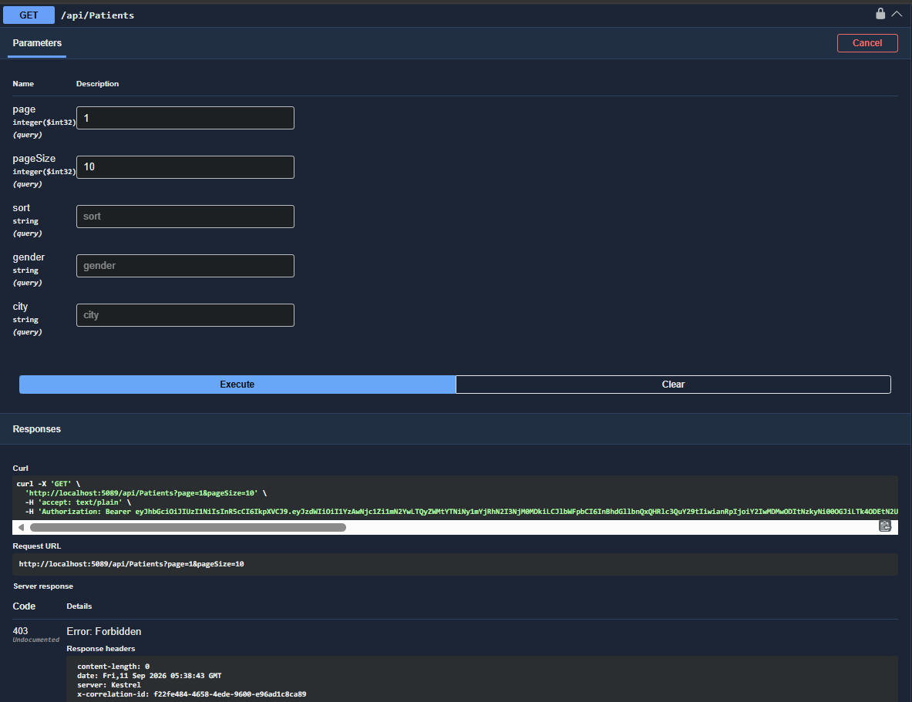
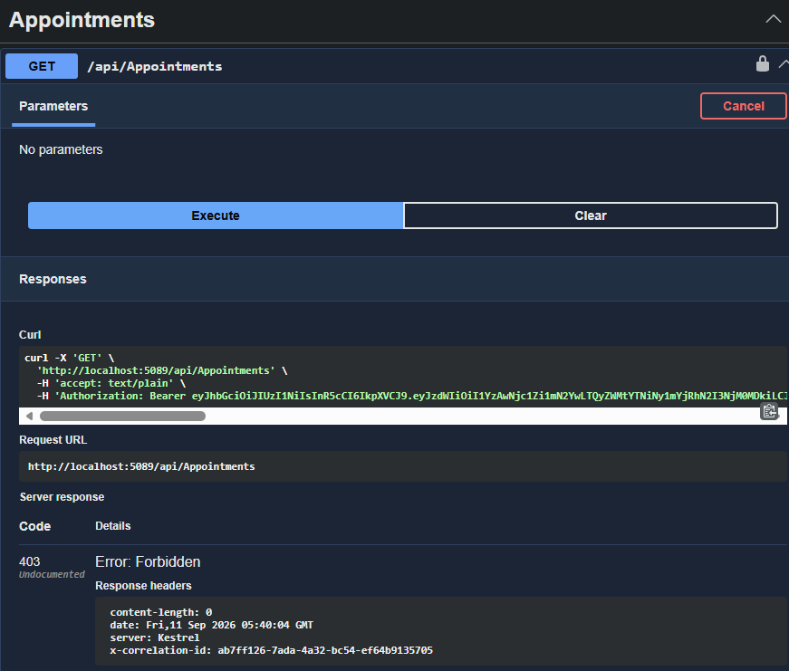

# Week 7 — Day 4: Custom Middleware & Cross-Cutting Concerns

## Overview

Day 4 focused on identifying a genuine cross-cutting concern in the Cardiac Patient Monitoring API and implementing it using custom middleware.

The main goal was to add request tracking to the API without repeating the same logic inside every controller or endpoint.

The selected concern was:

* Correlation ID for each request
* Request execution time
* Request logging

---

## 1. What Is a Cross-Cutting Concern?

A cross-cutting concern is functionality that can apply to many parts of an application instead of belonging to only one controller or endpoint.

For example, if we want to measure how long every API request takes, adding the same stopwatch and logging code to every controller would create repeated code.

Middleware is useful for this because it runs as part of the ASP.NET Core request pipeline and can handle the concern centrally.

---

## 2. How We Chose the Middleware

We considered several possible cross-cutting concerns.

### Request Logging and Timing

This allows us to know:

* Which request was made
* Which HTTP method was used
* Which endpoint was called
* What status code was returned
* How long the request took

### Correlation ID

A correlation ID gives each request its own unique identifier.

It is different from the `patientId`:

* `patientId` identifies the patient.
* `Correlation ID` identifies one specific API request.

This can help when tracing a request through application logs.

### Custom Rate Limiting

We also considered creating custom rate limiting for medication-order requests.

We decided not to implement it because ASP.NET Core already provides built-in rate-limiting functionality. Creating custom middleware for something that already has a framework solution would add unnecessary code.

### Final Decision

We chose **Correlation ID + Request Timing/Logging** because it is a genuine cross-cutting concern and can be applied to multiple API endpoints without modifying each controller.

---

## 3. What We Implemented

We created a custom middleware:

[`RequestTrackingMiddleware.cs`](./CardiacPatientMonitoring/CardiacPatientMonitoring.Api/Middleware/RequestTrackingMiddleware.cs)

The middleware performs the following steps for each request:

1. Creates a unique correlation ID.
2. Adds the correlation ID to the response header as `X-Correlation-ID`.
3. Starts a stopwatch.
4. Passes the request to the next middleware/controller.
5. Stops the stopwatch after the request finishes.
6. Logs the request information.

The log contains:

* Correlation ID
* HTTP method
* Request path
* Status code
* Elapsed time

Example:

```text
Correlation ID: f22fe484-4658-4ede-9600-e96ad1c8ca89
GET /api/Patients
Status Code: 403
Elapsed: 12 ms
```

---

## 4. Middleware Pipeline Registration

After creating the middleware, we registered it in `Program.cs`:

[`Program.cs`](./CardiacPatientMonitoring/CardiacPatientMonitoring.Api/Program.cs)

The relevant part is:

```csharp
// Redirects HTTP requests to HTTPS.
app.UseHttpsRedirection();

// Tracks request correlation IDs and execution time.
app.UseMiddleware<RequestTrackingMiddleware>();

// Handles unexpected exceptions before they reach the client.
app.UseMiddleware<GlobalExceptionMiddleware>();
```

The request-tracking middleware is therefore part of the general request pipeline rather than being added separately to each controller.

---

## 5. Why Middleware Instead of an Action Filter?

We briefly compared middleware with action filters.

### Middleware

Middleware works at the general HTTP request-pipeline level.

It is suitable for concerns that should apply broadly across requests, such as:

* Request logging
* Correlation IDs
* Timing
* Exception handling

### Action Filters

Action filters are closer to MVC controller actions.

They are more suitable when the logic needs information specific to an action, such as model binding or action arguments.

For this task, request tracking is general to the API, so middleware was the better choice.

---

## 6. Problem We Faced

While testing Day 4, the first request to the Patients endpoint returned:

```text
200 OK
```

This was unexpected because the Patient role should not be allowed to access the Admin-only `GET /api/Patients` endpoint.

The important part was that the response already contained:

```text
X-Correlation-ID
```

This showed that the new middleware itself was working.

### What We Discovered

The Day 4 project copy did not contain the RBAC changes that had been completed during Day 3.

When we inspected the Day 4 `PatientsController`, it still had the older authorization configuration.

For example, the Admin-only authorization used in Day 3 was missing from the Day 4 copy.

### How We Fixed It

We copied the Day 3 project version into the Day 4 project so that Day 4 continued from the correct version of the API.

After that, we restored the Day 4 middleware registration in `Program.cs`:

[`Program.cs`](./CardiacPatientMonitoring/CardiacPatientMonitoring.Api/Program.cs)

This gave us a Day 4 version containing both:

* The completed Day 3 RBAC/ownership work
* The new Day 4 request-tracking middleware

We then rebuilt and retested the API.

---

## 7. Testing

The API was tested using **Swagger**.

We used a Patient account to test endpoints that require the Admin role.

### Test 1 — Patients Admin Endpoint

Request:

```text
GET /api/Patients?page=1&pageSize=10
```

Expected result:

```text
403 Forbidden
```

Actual result:

```text
403 Forbidden
```

The response also contained an `X-Correlation-ID` header.



---

### Test 2 — Appointments Admin Endpoint

Request:

```text
GET /api/Appointments
```

Expected result:

```text
403 Forbidden
```

Actual result:

```text
403 Forbidden
```

A different correlation ID was generated for this request.



---

### Test 3 — Request Tracking Logs

The application logs were checked in PowerShell.

The logs showed requests from different endpoints being tracked by the same middleware:

```text
Correlation ID: f22fe484-4658-4ede-9600-e96ad1c8ca89 | GET /api/Patients | Status Code: 403 | Elapsed: 12 ms

Correlation ID: ab7ff126-7ada-4a32-bc54-ef64b9135705 | GET /api/Appointments | Status Code: 403 | Elapsed: 2 ms
```

This demonstrates that the middleware works across multiple endpoints without adding request-tracking code to each controller.


---

## 8. Build Verification

After the Day 4 changes, the API project was built successfully using:

```powershell
dotnet build
```

The application was also run successfully and tested through Swagger.

---

## 9. What We Achieved

By the end of Day 4, the API had a custom cross-cutting middleware that:

* Generates a unique correlation ID for each request.
* Returns the correlation ID through the `X-Correlation-ID` response header.
* Measures request execution time.
* Logs the HTTP method and request path.
* Logs the response status code.
* Works across multiple endpoints.
* Keeps request-tracking logic outside the controllers.
* Continues to use the RBAC and ownership rules implemented during Day 3.

---

## Result

Day 4 successfully added **Correlation ID and Request Timing/Logging middleware** to the Cardiac Patient Monitoring API.

The middleware was tested through multiple Swagger endpoints and verified through PowerShell logs.

During testing, we also identified and fixed an issue where the Day 4 project copy did not contain the RBAC changes completed during Day 3. After restoring the correct Day 3 version and registering the new middleware again, the Admin-only endpoints correctly returned `403 Forbidden` for the Patient role.

The final implementation provides a simple centralized way to track API requests without duplicating the same logic across controllers.
