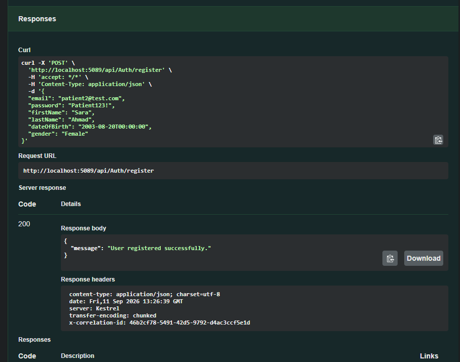
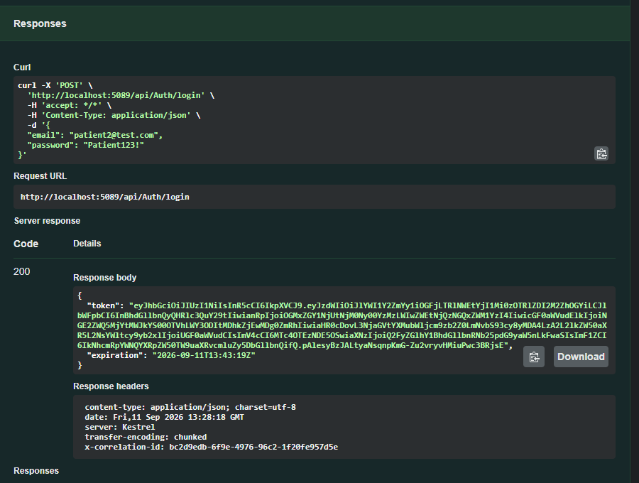
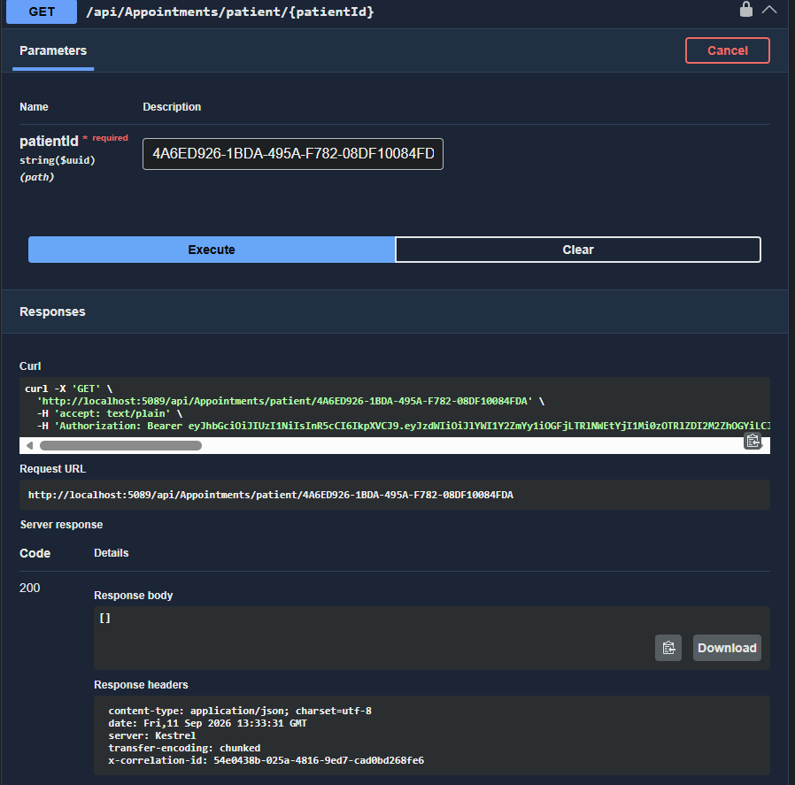
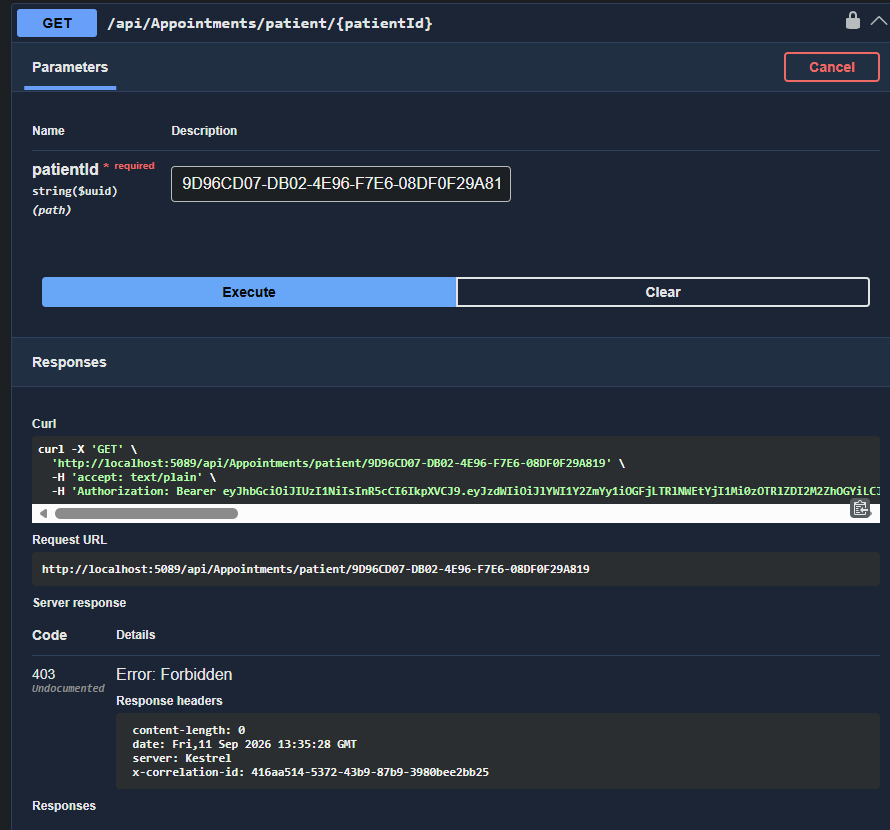
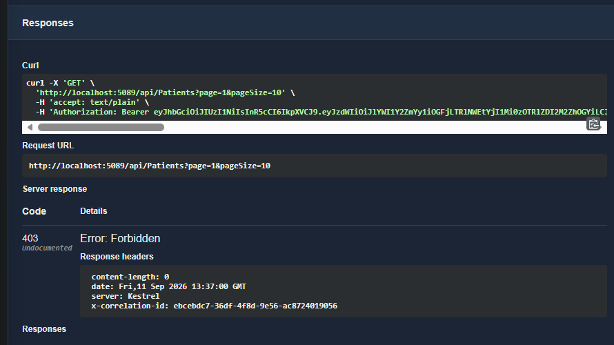
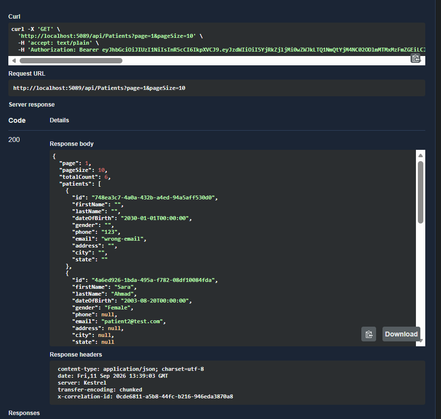
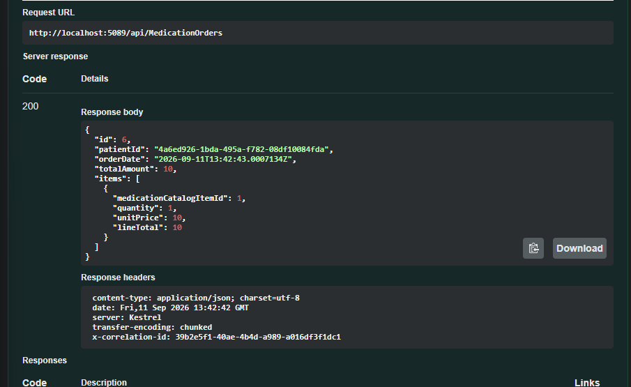
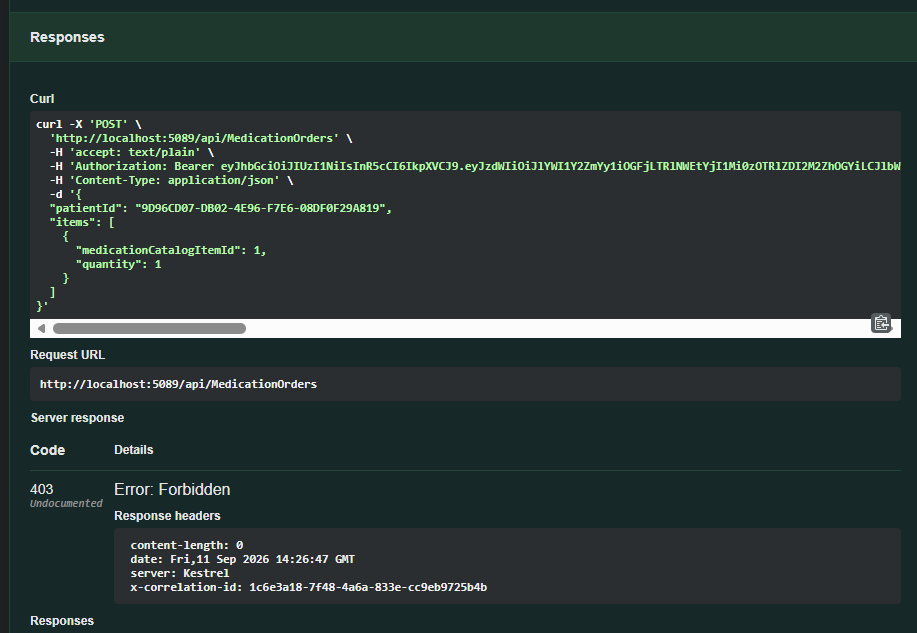
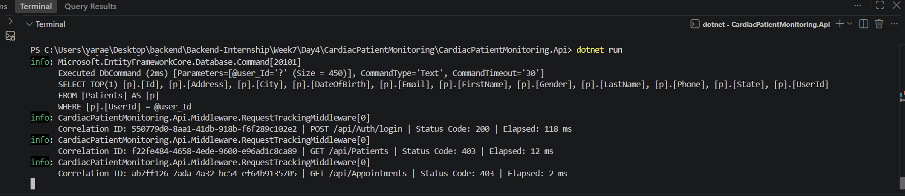

# Week 7 — Day 5: Sprint Review, Authentication & RBAC Demo, and Retrospective

## Overview

Day 5 concludes **Week 7 — Sprint 2** of the Cardiac Patient Monitoring API.

The main purpose of this day was to review and demonstrate the authentication and authorization features implemented during Sprint 2, verify the access rules for Patient and Admin users, test resource ownership, and document the Sprint 2 review and retrospective.

The API was tested using **Swagger UI**.

> **Note:** The Week 7 curriculum mentions Postman for the demo. For this implementation, Swagger UI was used for the practical API testing.

---

# 1. Sprint 2 Objectives

Sprint 2 focused on **Authentication & Role-Based Access**.

The main objectives were:

1. Integrate ASP.NET Core Identity with the capstone database.
2. Link the Patient entity to the Identity user.
3. Implement Patient registration.
4. Implement login and JWT token generation.
5. Include domain-relevant claims in the JWT.
6. Implement Patient and Admin roles.
7. Apply role-based authorization to protected endpoints.
8. Implement resource-based authorization.
9. Prevent Patients from accessing another Patient's resources.
10. Implement a custom middleware for a genuine cross-cutting concern.
11. Test successful and rejected authorization scenarios.

---

# 2. Authentication Flow

The authentication flow implemented during Sprint 2 is:

```text
Patient Registration
        ↓
Identity User Created
        ↓
Patient Record Created
        ↓
Patient linked to Identity User
        ↓
Patient Role Assigned
        ↓
Patient Login
        ↓
JWT Token Generated
        ↓
JWT Contains Patient ID + Role
        ↓
Token Used for Protected Endpoints
```

New users registered through the public registration endpoint receive the `Patient` role automatically.

The `Admin` role is not selectable during registration. The Admin account is created separately through Identity seeding.

---

# 3. Roles

Two domain-specific roles are used:

| Role      | Purpose                                                                |
| --------- | ---------------------------------------------------------------------- |
| `Patient` | Allows a patient to access permitted endpoints and their own resources |
| `Admin`   | Allows administrative access to protected resources                    |

The roles are created by:

[`IdentitySeeder.cs`](./CardiacPatientMonitoring/CardiacPatientMonitoring.Api/Data/IdentitySeeder.cs)

The seeded Admin account is:

```text
Email: admin@cardiac.local
Password: Admin123!
Role: Admin
```

---

# 4. JWT Authentication

After a successful login, the API generates a JWT.

The token contains claims including:

```text
sub
email
jti
patientId
role
iss
aud
```

For a Patient user, the most important domain-specific claims are:

```text
patientId
role = Patient
```

The `patientId` claim is used when checking ownership of Patient-specific resources.

The authentication implementation is available in:

[`AuthController.cs`](./CardiacPatientMonitoring/CardiacPatientMonitoring.Api/Controllers/AuthController.cs)

---

# 5. Resource-Based Authorization

Role-based authorization by itself is not sufficient for Patient data.

For example, both Sara and Ahmad can have the `Patient` role.

Therefore, the API also compares the Patient ID from the authenticated user's JWT with the Patient ID of the requested resource.

```text
JWT patientId
      ↓
Compare with requested patientId
      ↓
Same Patient?
   ↓       ↓
  Yes      No
   ↓        ↓
 Allow    403
```

Admin users can access resources according to the endpoint authorization policy.

This prevents a Patient from using a valid JWT to access another Patient's information.

---

# 6. Testing Environment

The API was tested locally using:

```text
http://localhost:5089
```

Swagger UI:

```text
http://localhost:5089/swagger
```

Database:

```text
CardiacPatientMonitoringDb
```

SQL Server:

```text
(localdb)\MSSQLLocalDB
```

All API tests in this README were performed through Swagger UI.

---

# 7. Test 1 — Patient Registration

## Purpose

Verify that a new Patient can register through the public registration endpoint.

## Endpoint

```http
POST /api/Auth/register
```

## Request

The following data was entered in Swagger:

```json
{
  "email": "patient2@test.com",
  "password": "Patient123!",
  "firstName": "Sara",
  "lastName": "Ahmad",
  "dateOfBirth": "2003-08-20T00:00:00",
  "gender": "Female"
}
```

## Expected Result

A new Identity user and linked Patient account should be created successfully.

The new account should receive the `Patient` role.

## Actual Result

The API returned:

```text
200 OK
```

Response:

```json
{
  "message": "User registered successfully."
}
```

Correlation ID:

```text
46b2cf78-5491-42d5-9792-d4ac3ccf5e1d
```

## Result

The registration flow worked successfully.

### Screenshot



---

# 8. Test 2 — Patient Login and JWT

## Purpose

Verify that the newly registered Patient can log in and receive a JWT token.

## Endpoint

```http
POST /api/Auth/login
```

## Credentials

```text
Email: patient2@test.com
Password: Patient123!
```

## Expected Result

The API should authenticate the Patient and return a JWT.

The JWT should contain the Patient's role and Patient ID.

## Actual Result

Login succeeded with:

```text
200 OK
```

The returned JWT was then entered into Swagger using the **Authorize** button.

Sara's Patient ID is:

```text
4A6ED926-1BDA-495A-F782-08DF10084FDA
```

The JWT contained the Patient role and Patient ID claim.

## Result

The Patient authentication flow worked successfully.

### Screenshot



---

# 9. Test 3 — Patient Accesses Their Own Appointments

## Purpose

Verify resource-based authorization for a Patient accessing their own data.

## Endpoint

```http
GET /api/Appointments/patient/{patientId}
```

Sara's Patient ID:

```text
4A6ED926-1BDA-495A-F782-08DF10084FDA
```

## Request

```http
GET /api/Appointments/patient/4A6ED926-1BDA-495A-F782-08DF10084FDA
```

Sara's JWT was used for the request.

## Expected Result

Because the Patient ID in the JWT matches the Patient ID in the request, the request should be allowed.

## Actual Result

The API returned:

```text
200 OK
```

Response:

```json
[]
```

The empty array means that Sara currently has no appointments. The authorization check itself was successful.

Correlation ID:

```text
54e0438b-025a-4816-9ed7-cad0bd26
```

## Result

Sara successfully accessed her own Patient-specific data.

### Screenshot



---

# 10. Test 4 — Patient Attempts to Access Another Patient's Data

## Purpose

Verify that a Patient cannot access another Patient's resources.

Ahmad's Patient ID:

```text
9D96CD07-DB02-4E96-F7E6-08DF0F29A819
```

Sara's authenticated Patient ID:

```text
4A6ED926-1BDA-495A-F782-08DF10084FDA
```

These IDs do not match.

## Request

Sara's JWT was used to request Ahmad's appointments:

```http
GET /api/Appointments/patient/9D96CD07-DB02-4E96-F7E6-08DF0F29A819
```

## Expected Result

The request should be rejected because Sara does not own Ahmad's data.

Expected status:

```text
403 Forbidden
```

## Actual Result

The API returned:

```text
403 Forbidden
```

## Result

The resource ownership check worked correctly.

A Patient cannot access another Patient's Patient-specific data.

### Screenshot



---

# 11. Test 5 — Patient Attempts to Access an Admin-Only Endpoint

## Purpose

Verify role-based authorization.

The `GET /api/Patients` endpoint is restricted to Admin users.

## Request

Sara's Patient JWT was used to request:

```http
GET /api/Patients?page=1&pageSize=10
```

## Expected Result

Sara has the `Patient` role, while this endpoint requires the `Admin` role.

Expected status:

```text
403 Forbidden
```

## Actual Result

The API returned:

```text
403 Forbidden
```

## Result

Role-based authorization successfully prevented a Patient from accessing an Admin-only endpoint.

### Screenshot



---

# 12. Test 6 — Admin Accesses the Admin-Only Endpoint

## Purpose

Verify that an Admin user can access an endpoint protected by the Admin role.

## Admin Credentials

```text
Email: admin@cardiac.local
Password: Admin123!
```

The Admin account was authenticated and its JWT was used in Swagger.

## Request

```http
GET /api/Patients?page=1&pageSize=10
```

## Expected Result

Because the authenticated user has the `Admin` role, the request should be allowed.

Expected status:

```text
200 OK
```

## Actual Result

The API returned:

```text
200 OK
```

## Result

The authorization system correctly distinguishes between Patient and Admin users.

### Screenshot



---

# 13. Test 7 — Patient Creates Their Own Medication Order

## Purpose

Verify that a Patient can create a Medication Order for themselves.

## Endpoint

```http
POST /api/MedicationOrders
```

Sara's Patient ID:

```text
4A6ED926-1BDA-495A-F782-08DF10084FDA
```

Before creating the order, the medication catalog was checked.

Example catalog entries:

|  ID | Medication         | Unit Price | Stock |
| --: | ------------------ | ---------: | ----: |
|   1 | Aspirin 81 mg      |      10.00 |     8 |
|   2 | Atorvastatin 20 mg |      25.50 |     5 |
|   3 | Metoprolol 25 mg   |       7.75 |     1 |

Medication catalog item `1` was used.

## Request

```json
{
  "patientId": "4A6ED926-1BDA-495A-F782-08DF10084FDA",
  "items": [
    {
      "medicationCatalogItemId": 1,
      "quantity": 1
    }
  ]
}
```

## Expected Result

Because Sara's JWT Patient ID matches the `patientId` in the request, the order should be accepted.

## Actual Result

The API returned:

```text
200 OK
```

Response:

```json
{
  "id": 6,
  "patientId": "4a6ed926-1bda-495a-f782-08df10084fda",
  "orderDate": "2026-09-11T13:42:43.0007134Z",
  "totalAmount": 10,
  "items": [
    {
      "medicationCatalogItemId": 1,
      "quantity": 1,
      "unitPrice": 10,
      "lineTotal": 10
    }
  ]
}
```

Correlation ID:

```text
39b2e5f1-40ae-4b4d-a989-a016df3f1dc1
```

## Result

Sara successfully created a medication order for herself.

### Screenshot



---

# 14. Test 8 — Patient Attempts to Create an Order for Another Patient

## Purpose

Verify that resource ownership is also enforced when creating Medication Orders.

Sara should not be able to create an order for Ahmad.

Sara's Patient ID:

```text
4A6ED926-1BDA-495A-F782-08DF10084FDA
```

Ahmad's Patient ID:

```text
9D96CD07-DB02-4E96-F7E6-08DF0F29A819
```

## Request

Sara's JWT was used while sending Ahmad's Patient ID:

```json
{
  "patientId": "9D96CD07-DB02-4E96-F7E6-08DF0F29A819",
  "items": [
    {
      "medicationCatalogItemId": 1,
      "quantity": 1
    }
  ]
}
```

## Expected Result

The API should compare the authenticated Patient ID with the requested Patient ID.

They do not match.

Expected status:

```text
403 Forbidden
```

## Actual Result

The API returned:

```text
403 Forbidden
```

## Result

The ownership check successfully prevented Sara from creating a medication order for another Patient.

### Screenshot



---

# 15. Request Tracking Middleware

Sprint 2 also includes custom request-tracking middleware.

The middleware provides two main cross-cutting concerns:

1. Correlation ID
2. Request execution timing and logging

The middleware generates a unique correlation ID for each request.

It also records:

- HTTP method
- Request path
- Response status code
- Execution time

The response contains:

```text
X-Correlation-ID
```

Code:

[`RequestTrackingMiddleware.cs`](./CardiacPatientMonitoring/CardiacPatientMonitoring.Api/Middleware/RequestTrackingMiddleware.cs)

The middleware is registered in:

[`Program.cs`](./CardiacPatientMonitoring/CardiacPatientMonitoring.Api/Program.cs)

Example log:

```text
Correlation ID: f22fe484-4658-4ede-9600-e96ad1c8ca89
GET /api/Patients
Status Code: 403
Elapsed: 12 ms
```

Another request:

```text
Correlation ID: ab7ff126-7ada-4a32-bc54-ef64b9135705
GET /api/Appointments
Status Code: 403
Elapsed: 2 ms
```

The middleware works across multiple endpoints without requiring separate request-tracking code in each controller.

### Screenshot



---

# 16. Authorization Summary

The final authorization behavior demonstrated during Sprint 2 is:

| Operation                                      | Patient |             Admin |
| ---------------------------------------------- | ------: | ----------------: |
| Public registration                            |     Yes | No role selection |
| Login                                          |     Yes |               Yes |
| Access own Patient-specific data               |     Yes |               Yes |
| Access another Patient's Patient-specific data |      No |               Yes |
| Access Admin-only Patient list                 |      No |               Yes |
| Create own Medication Order                    |     Yes |               Yes |
| Create Medication Order for another Patient    |      No |               Yes |

The tests covered both successful and deliberately rejected requests.

---

# 17. Important Sprint 2 Fix — Vital Signs Authorization

During the final review, the `VitalSignsController` was found to be missing several required RBAC and ownership checks.

The missing checks affected operations such as:

- Getting all vital signs
- Getting a specific vital sign
- Getting vital signs by Patient ID
- Creating a vital sign
- Updating a vital sign

The controller was corrected before completing Sprint 2.

The final authorization behavior follows the Sprint 2 model:

- Admin can access permitted resources.
- Patient can access their own resources.
- Patient cannot access another Patient's resources.
- Admin-only operations remain protected.

This issue was fixed as part of Sprint 2 because RBAC and resource ownership were required Sprint 2 objectives.

---

# 18. Build Verification

After the final authorization corrections, the project was built successfully.

Command:

```powershell
dotnet build
```

Result:

```text
Build succeeded.
```

The API was also run successfully on:

```text
http://localhost:5089
```

Swagger was available for the final API tests.

---

# 19. Sprint Review

## Completed Sprint 2 Work

The following Sprint 2 work was completed:

- ASP.NET Core Identity integrated with the capstone database.
- Patient entity linked to Identity user.
- Patient registration implemented.
- Patient login implemented.
- JWT authentication implemented.
- Patient ID included in JWT claims.
- Patient and Admin roles implemented.
- Public registration assigns the Patient role.
- Admin account seeded separately.
- Role-based authorization implemented.
- Resource-based ownership checks implemented.
- Patient-to-Patient access restrictions tested.
- Admin-only endpoint restrictions tested.
- Patient medication-order ownership tested.
- Custom request-tracking middleware implemented.
- Correlation IDs added to responses.
- Request timing and logging implemented.
- Authorization issue in `VitalSignsController` identified and corrected.
- Final build verified successfully.

---

# 20. Sprint 2 Acceptance Review

## Authentication

```text
Registration                    → Passed
Login                           → Passed
JWT generation                  → Passed
Patient ID claim                → Passed
Role claim                      → Passed
```

## Role-Based Authorization

```text
Patient blocked from Admin endpoint → Passed
Admin allowed on Admin endpoint     → Passed
```

## Resource-Based Authorization

```text
Patient accesses own data                  → Passed
Patient blocked from another Patient      → Passed
Patient creates own medication order       → Passed
Patient blocked from other Patient order   → Passed
```

## Middleware

```text
Correlation ID                → Passed
Response header               → Passed
Request timing                → Passed
Request logging               → Passed
Multiple endpoint coverage    → Passed
```

---

# 21. Sprint 2 Retrospective

## What Went Well

### Authentication became connected to the domain

The JWT includes the Patient ID for linked Patient accounts.

This allowed the API to perform ownership checks instead of relying only on the user's role.

### Authorization was tested with both success and failure cases

The testing included successful requests as well as deliberate rejection cases.

Examples:

```text
Patient → Own data → 200 OK
Patient → Other Patient's data → 403 Forbidden
Patient → Admin endpoint → 403 Forbidden
Admin → Admin endpoint → 200 OK
```

This made it possible to verify that the authorization rules were actually being enforced.

### Request tracking provided useful request-level information

The correlation ID makes it possible to identify a specific request in the application logs, while the elapsed time shows how long that request took.

### Authorization gaps were caught before completing the sprint

The missing authorization rules in `VitalSignsController` were identified during the final review and corrected before completing Sprint 2.

---

# 22. What Could Be Improved

Authorization checks should be reviewed earlier when implementing each controller.

A useful review sequence is:

```text
Authentication
      ↓
Role requirement
      ↓
Ownership requirement
      ↓
Admin access where appropriate
      ↓
Forbidden scenario
```

This would reduce the chance of discovering missing authorization rules during the final sprint review.

---

# 23. Concrete Sprint 3 Action

For Sprint 3, the team should use an **authorization test checklist** for every protected resource.

For each protected endpoint, verify:

```text
Unauthenticated request
Patient accessing own resource
Patient accessing another Patient's resource
Admin accessing permitted resource
Admin-only operation
```

The purpose is to catch authorization and ownership issues earlier during development.

---

# 24. Sprint 3 Backlog

Sprint 2 requirements that were identified and corrected during this sprint are **not** moved to Sprint 3.

No authentication, RBAC, resource ownership, or middleware requirement is being marked incomplete simply because an issue was found and fixed during Sprint 2.

Only genuinely unfinished work or new requirements should be added to the Sprint 3 backlog.

---

# 25. Final Result

Sprint 2 successfully established the authentication and authorization foundation of the Cardiac Patient Monitoring API.

The system now supports:

```text
Identity
   ↓
Registration
   ↓
Login
   ↓
JWT
   ↓
Patient / Admin Roles
   ↓
Role-Based Authorization
   ↓
Resource-Based Authorization
   ↓
Protected Patient Data
```

The final testing demonstrated:

```text
Patient → Own data → 200 OK

Patient → Other Patient's data
        → 403 Forbidden

Patient → Admin endpoint
        → 403 Forbidden

Admin → Admin endpoint
      → 200 OK

Patient → Own medication order
        → 200 OK

Patient → Other Patient's medication order
        → 403 Forbidden
```

The custom request-tracking middleware also demonstrated that requests can be identified using correlation IDs and monitored through execution-time logging.

The project build completed successfully after the final authorization corrections.

---

# 26. Related Code

### Authentication

[`AuthController.cs`](./CardiacPatientMonitoring/CardiacPatientMonitoring.Api/Controllers/AuthController.cs)

### Identity Seeding

[`IdentitySeeder.cs`](./CardiacPatientMonitoring/CardiacPatientMonitoring.Api/Data/IdentitySeeder.cs)

### Patient Entity

[`Patient.cs`](./CardiacPatientMonitoring/CardiacPatientMonitoring.Api/Entities/Patient.cs)

### Database Context

[`CardiacPatientMonitoringDbContext.cs`](./CardiacPatientMonitoring/CardiacPatientMonitoring.Api/Data/CardiacPatientMonitoringDbContext.cs)

### Patients Authorization

[`PatientsController.cs`](./CardiacPatientMonitoring/CardiacPatientMonitoring.Api/Controllers/PatientsController.cs)

### Appointments Authorization

[`AppointmentsController.cs`](./CardiacPatientMonitoring/CardiacPatientMonitoring.Api/Controllers/AppointmentsController.cs)

### Medications Authorization

[`MedicationsController.cs`](./CardiacPatientMonitoring/CardiacPatientMonitoring.Api/Controllers/MedicationsController.cs)

### Vital Signs Authorization

[`VitalSignsController.cs`](./CardiacPatientMonitoring/CardiacPatientMonitoring.Api/Controllers/VitalSignsController.cs)

### Medication Orders Authorization

[`MedicationOrdersController.cs`](./CardiacPatientMonitoring/CardiacPatientMonitoring.Api/Controllers/MedicationOrdersController.cs)

### Request Tracking Middleware

[`RequestTrackingMiddleware.cs`](./CardiacPatientMonitoring/CardiacPatientMonitoring.Api/Middleware/RequestTrackingMiddleware.cs)

### Application Pipeline

[`Program.cs`](./CardiacPatientMonitoring/CardiacPatientMonitoring.Api/Program.cs)
