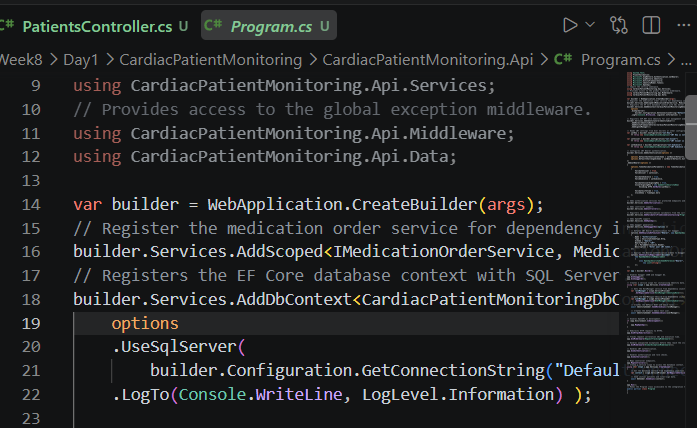
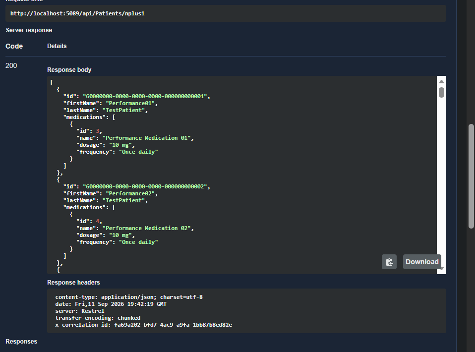
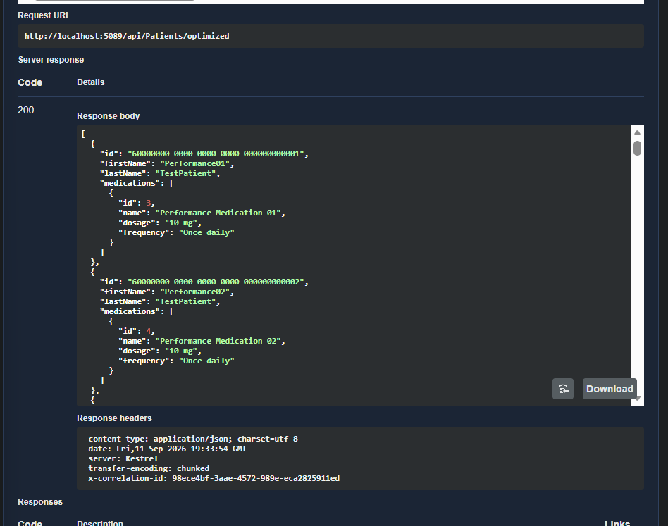

# Week 8 — Day 1: Sprint 3 Planning & Diagnosing the N+1 Problem

## Overview

Day 1 of Sprint 3 focused on understanding how the API accesses the database and checking for the **N+1 query problem**.

Instead of assuming that the project had an N+1 problem, we first reviewed the existing endpoints and then enabled EF Core SQL logging to observe the actual database queries.

After checking the existing endpoints, we did not find a genuine N+1 problem in them. Therefore, an experimental endpoint was created to demonstrate the N+1 pattern, verify it through the generated SQL, and then implement an optimized version.

---

## Objectives

By the end of Day 1, we aimed to:

* Define the Sprint 3 performance goal.
* Carry forward an improvement from the Sprint 2 retrospective.
* Understand the N+1 query problem.
* Enable EF Core SQL logging.
* Review important existing list endpoints.
* Identify and verify an N+1 query pattern.
* Implement an optimized approach.
* Compare the database queries before and after optimization.
* Work toward a measurable target of a maximum of two database queries for the investigated Patient-Medication access pattern.
* Document the findings based on actual testing.

---

## Sprint 3 Planning

The Sprint 3 planning document was created before starting the performance investigation.

It defines the sprint goal, the Sprint 2 retrospective action, the Day 1 investigation target, the planned steps, and the expected outcome.

**Planning document:**

[Sprint3-Planning.md](Planning/Sprint3-Planning.md)

The main approach was:

```text
Review existing endpoints

        ↓

Enable EF Core SQL logging

        ↓

Test actual database behavior

        ↓

Check for N+1

        ↓

Create an experimental example if needed

        ↓

Confirm the generated SQL

        ↓

Optimize the query pattern

        ↓

Test again
```

---

# 1. Enabling EF Core SQL Logging

The first practical step was enabling EF Core SQL logging.

**Code:**

[Program.cs](CardiacPatientMonitoring/CardiacPatientMonitoring.Api/Program.cs)

The existing SQL Server configuration was updated to include:

```csharp
builder.Services.AddDbContext<CardiacPatientMonitoringDbContext>(options =>
    options
        .UseSqlServer(
            builder.Configuration.GetConnectionString("DefaultConnection"))
        .LogTo(Console.WriteLine, LogLevel.Information));
```

### Why did we add this?

Normally, the API response only shows the returned data.

It does not clearly show how many SQL queries EF Core executed to produce that response.

By enabling logging, we could observe the SQL commands generated by EF Core and use them to verify the database behavior of each endpoint.

### Screenshot



---

# 2. Reviewing the Existing Endpoints

Before creating an N+1 example, we reviewed the existing list endpoints.

The main endpoints investigated were:

* Patients
* Appointments
* VitalSigns
* Medications

The goal was to determine whether any of the existing implementations were already loading related data through a separate database query for every returned record.

### Patients

**Code:**

[PatientsController.cs](CardiacPatientMonitoring/CardiacPatientMonitoring.Api/Controllers/PatientsController.cs)

The Patients list endpoint uses:

* `CountAsync()` to get the total number of matching Patients.
* A second query to retrieve the requested page.

Therefore, the endpoint uses two database queries for its normal pagination flow.

This is **not** an N+1 pattern.

### Appointments

**Code:**

[AppointmentsController.cs](CardiacPatientMonitoring/CardiacPatientMonitoring.Api/Controllers/AppointmentsController.cs)

The endpoint uses projection to retrieve the required data without executing a separate related-data query for every Appointment.

The test showed one main database query.

### VitalSigns

**Code:**

[VitalSignsController.cs](CardiacPatientMonitoring/CardiacPatientMonitoring.Api/Controllers/VitalSignsController.cs)

The endpoint also uses projection and does not load related data through a query inside a loop.

The test showed one main database query.

### Medications

**Code:**

[MedicationsController.cs](CardiacPatientMonitoring/CardiacPatientMonitoring.Api/Controllers/MedicationsController.cs)

The list endpoint also uses projection and did not show an N+1 pattern during the investigation.

---

# 3. Creating an Experimental N+1 Example

After reviewing the existing endpoints, we did not find a genuine N+1 problem in the current implementation.

However, N+1 was an important part of the Sprint 3 learning objective.

Instead of claiming that an existing endpoint had the problem, we created an **experimental endpoint** specifically to demonstrate the inefficient pattern and measure it using EF Core logs.

### Endpoint

`GET /api/Patients/nplus1`

**Code:**

[PatientsController.cs](CardiacPatientMonitoring/CardiacPatientMonitoring.Api/Controllers/PatientsController.cs)

The endpoint first loads all Patients:

```csharp
var patients = await _context.Patients
    .AsNoTracking()
    .ToListAsync();
```

It then loops through the Patients and loads their Medications separately:

```csharp
foreach (var patient in patients)
{
    var medications = await _context.Medications
        .AsNoTracking()
        .Where(medication => medication.PatientId == patient.Id)
        .Select(medication => new
        {
            medication.Id,
            medication.Name,
            medication.Dosage,
            medication.Frequency
        })
        .ToListAsync();
}
```

### Why does this create N+1?

The first query loads all Patients.

Then every Patient causes another query for its Medications.

For `N` Patients, the pattern becomes:

```text
1 Patients query + N Medication queries
```

That is the N+1 query problem.

This endpoint was created only for demonstration and learning. It is not intended to be used as a production endpoint.

---

# 4. Testing the N+1 Endpoint

The experimental endpoint was tested through Swagger:

`GET /api/Patients/nplus1`

The request returned:

**200 OK**

### Test data

At the time of this test, there were **51 Patients** in the database.

Therefore, the expected database access pattern was:

```text
1 Patients query
+
51 Medication queries
=
52 database queries
```

The EF Core logs confirmed this behavior.

The logs showed:

1. One query loading the Patients.
2. Repeated Medication queries.
3. Each Medication query filtered by the current Patient ID.

This confirmed a genuine N+1 query pattern.

### Important

The repeated logger output shown in the terminal does not mean that the database command was executed twice.

The same command can appear in more than one logger format. The query count was based on the actual SQL commands being executed.

### Screenshot



---

# 5. Optimizing the Query Pattern

After confirming the N+1 behavior, we created an optimized version.

### Endpoint

`GET /api/Patients/optimized`

**Code:**

[PatientsController.cs](CardiacPatientMonitoring/CardiacPatientMonitoring.Api/Controllers/PatientsController.cs)

The optimized endpoint first loads the Patients once:

```csharp
var patients = await _context.Patients
    .AsNoTracking()
    .ToListAsync();
```

Then it collects the Patient IDs:

```csharp
var patientIds = patients
    .Select(patient => patient.Id)
    .ToList();
```

Instead of querying Medications inside a loop, all required Medications are loaded using one database query:

```csharp
var medications = await _context.Medications
    .AsNoTracking()
    .Where(medication => patientIds.Contains(medication.PatientId))
    .Select(medication => new
    {
        medication.PatientId,
        medication.Id,
        medication.Name,
        medication.Dosage,
        medication.Frequency
    })
    .ToListAsync();
```

The response is then built in memory using the data that has already been loaded.

---

# 6. Why Is the Optimized Version Better?

### Experimental N+1 approach

```text
Load Patients
     ↓
1 query
     ↓
For every Patient:
     ↓
Load Medications
     ↓
1 additional query
```

The number of database queries increases as the number of Patients increases.

### Optimized approach

```text
Load all Patients
     ↓
1 query

Load all required Medications
     ↓
1 query

Combine data in memory
```

This avoids sending a new database request for every Patient.

---

# 7. Testing the Optimized Endpoint

The optimized endpoint was tested through Swagger:

`GET /api/Patients/optimized`

The request returned:

**200 OK**

At the time of this test, the database contained **60 Patients**.

The EF Core logs showed two database commands:

### Query 1

One query loaded the Patients.

### Query 2

One query loaded the related Medications using an SQL `IN` condition containing the Patient IDs.

The SQL contained multiple parameters such as:

```text
@patientIds1
@patientIds2
...
@patientIds60
```

These parameters were all part of **one SQL command**.

They were not 60 separate database queries.

Therefore, the optimized endpoint used:

**2 database queries**

for the tested scenario.

### Screenshot



---

# 8. Results Comparison

| Approach         | Patients During Test | Database Queries | Result        |
| ---------------- | -------------------: | ---------------: | ------------- |
| Experimental N+1 |                   51 |               52 | N+1 confirmed |
| Optimized        |                   60 |                2 | N+1 avoided   |

The tests used different numbers of Patients because the database contents changed between the two tests.

The numbers above represent the actual data and query behavior observed during each test.

---

# 9. Performance Target

The measurable target for the Patient-Medication access pattern investigated during Day 1 was to reduce the database access pattern to a maximum of **two database queries**.

The experimental N+1 endpoint required 52 database queries for 51 Patients.

The optimized endpoint required two database queries for 60 Patients.

Therefore, the optimized implementation achieved the Day 1 target for the tested scenario.

---

# 10. What We Learned

The main lesson from this investigation is that an API can return the correct data while still making inefficient database requests.

The N+1 problem happens when an application:

1. Loads a collection using one query.
2. Then executes another database query for every item in that collection.

This can become expensive as the amount of data increases.

The optimized approach loads the required related data in a batch and combines the results in memory.

This reduces unnecessary database round trips.

---

# 11. Day 1 Outcome

Day 1 successfully completed the Sprint 3 investigation.

We:

* Created the Sprint 3 planning document.
* Carried a testing improvement from Sprint 2 into Sprint 3.
* Enabled EF Core SQL logging.
* Reviewed the existing list endpoints.
* Confirmed that the existing endpoints did not contain an N+1 pattern.
* Created an experimental N+1 endpoint.
* Verified the N+1 behavior using actual EF Core logs.
* Implemented an optimized endpoint.
* Tested the optimized endpoint through Swagger.
* Confirmed the optimized approach uses two database queries in the tested scenario.
* Achieved the measurable target of a maximum of two database queries for the investigated Patient-Medication access pattern.
* Documented the findings based on actual evidence.

---

# 12. Evidence

The following screenshots were captured for Day 1:

### 1. EF Core SQL Logging


Shows the EF Core logging configuration added to `Program.cs`.

### 2. N+1 Endpoint


Shows the experimental N+1 endpoint returning `200 OK`.

### 3. Optimized Endpoint


Shows the optimized endpoint returning `200 OK`.

The actual SQL query behavior was verified from the EF Core logs during the tests.

---

# 13. Sprint 3 Backlog

Based on the Day 1 investigation:

* Replace the confirmed N+1 Patient-Medication access pattern with the optimized batched approach so that related Medications are loaded without a separate database query for each Patient.

* Continue reviewing important endpoints for inefficient database access patterns.

* Measure query behavior before and after performance changes.

* Avoid loading related data through database queries inside loops.

* Continue using EF Core logging when investigating database performance.

* Review additional endpoints for possible performance improvements as Sprint 3 continues.

---

# Important Note

The N+1 endpoint was intentionally created as an experimental learning endpoint to demonstrate the problem after the existing endpoints were tested and no genuine N+1 issue was found.

All documented query counts and performance findings are based on actual testing and EF Core logs.

---

## Conclusion

Day 1 demonstrated the complete performance investigation process:

```text
Review

  ↓

Measure

  ↓

Verify

  ↓

Demonstrate

  ↓

Optimize

  ↓

Measure Again
```

The existing endpoints were checked first, an N+1 pattern was then intentionally demonstrated in an experimental endpoint, and the optimized approach was tested against the same type of database relationship.

The investigation provides a baseline for continuing Sprint 3 performance work.
