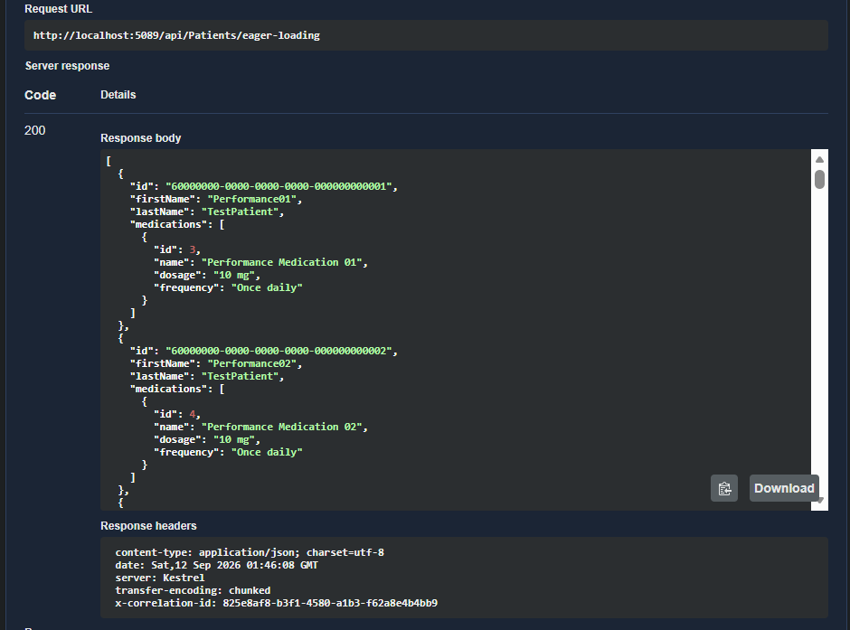
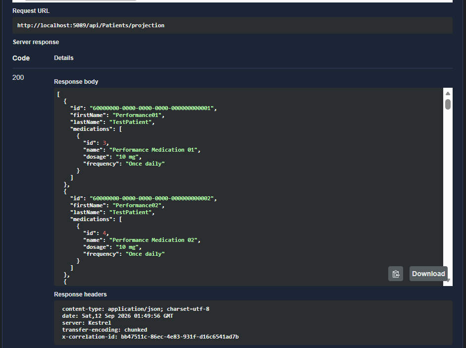

# Week 8 — Day 2: Query Optimization with Eager Loading & Projection

## Overview

Day 2 of Sprint 3 focused on optimizing database access in the **Cardiac Patient Monitoring API**.

The main focus was the **N+1 query problem** identified and measured during Day 1.

In Day 1, an experimental endpoint demonstrated how loading related data inside a loop can cause a large number of database queries.

For 51 Patients, the experimental N+1 endpoint generated:

**1 Patients query + 51 Medication queries = 52 database queries**

During Day 2, two Entity Framework Core approaches were implemented and measured:

- **Eager Loading with `Include`**
- **Projection with `Select`**

Both approaches were tested using Swagger and verified using EF Core SQL logging.

---

## Day 2 Objectives

The goals for Day 2 were:

1. Apply eager loading with `Include` to the Patient-Medication access pattern.
2. Confirm the actual number of SQL queries generated.
3. Use projection as an alternative to loading complete entities.
4. Compare the two approaches using actual SQL logs.
5. Check whether `AsSplitQuery` was applicable to the current project.
6. Document the measured results.

---

# 1. Background: The N+1 Query Problem

The N+1 problem happens when an application first loads a list of records and then sends another database query for each record to load related data.

For example:

```text
Load 51 Patients
        ↓
1 database query

For each Patient:
    Load that Patient's Medications
        ↓
51 additional database queries
```

This produces:

```text
1 + 51 = 52 database queries
```

The problem becomes more expensive as the number of records increases.

The N+1 pattern was intentionally demonstrated in Day 1 using:

`GET /api/Patients/nplus1`

The Day 1 investigation confirmed the behavior using actual EF Core SQL logs.

The Day 1 optimized version reduced the same access pattern to two database queries.

---

# 2. Eager Loading with Include

## What is Eager Loading?

Eager loading means asking Entity Framework Core to load related data together with the main entity.

The `Include` method is used to load a related navigation property.

In this project, a Patient has a collection of Medications:

```csharp
public ICollection<Medication> Medications { get; set; } = new List<Medication>();
```

The following endpoint was added:

`GET /api/Patients/eager-loading`

### Implementation

The endpoint uses:

```csharp
var patients = await _context.Patients
    .AsNoTracking()
    .Include(patient => patient.Medications)
    .ToListAsync();
```

The important part is:

```csharp
.Include(patient => patient.Medications)
```

This tells EF Core to load the Patients and their related Medications as part of the database query.

### Response

After the data is loaded, the response is created from the data already in memory:

```csharp
var result = patients.Select(patient => new
{
    patient.Id,
    patient.FirstName,
    patient.LastName,

    Medications = patient.Medications
        .Select(medication => new
        {
            medication.Id,
            medication.Name,
            medication.Dosage,
            medication.Frequency
        })
        .ToList()
});
```

No database query is executed inside this `Select`.

### Full Endpoint

```csharp
// Week 8 - Day 2
// Demonstrates eager loading with Include to avoid the N+1 query problem.
[HttpGet("eager-loading")]
[Authorize(Roles = "Admin")]
public async Task<IActionResult> GetPatientsWithMedicationsEagerLoading()
{
    // Load all patients from the database.
    var patients = await _context.Patients
        .AsNoTracking()

        // Load all medications related to the patients
        // as part of the same database query.
        .Include(patient => patient.Medications)
        .ToListAsync();

    // Build the API response using the data already loaded.
    // No additional database queries are needed here.
    var result = patients.Select(patient => new
    {
        patient.Id,
        patient.FirstName,
        patient.LastName,

        // Return the medications that were loaded with the patient.
        Medications = patient.Medications
            .Select(medication => new
            {
                medication.Id,
                medication.Name,
                medication.Dosage,
                medication.Frequency
            })
            .ToList()
    });

    // Return the patients and their medications.
    return Ok(result);
}
```

### Generated SQL

EF Core generated one SQL command using a `LEFT JOIN` between Patients and Medications.

The important structure was:

```sql
SELECT ...
FROM [Patients] AS [p]
LEFT JOIN [Medications] AS [m]
    ON [p].[Id] = [m].[PatientId]
ORDER BY [p].[Id]
```

This means the related Medications were loaded through the same database query.

### Measured Result

The endpoint was tested through Swagger and returned:

**200 OK**

EF Core SQL logging confirmed:

**1 database query**

Correlation ID:

`825e8af8-b3f1-4580-a1b3-f62a8e4b4bb9`

The authentication queries that appeared before the endpoint query were not included in this count. Only the SQL commands generated by the tested endpoint were counted.

### Swagger Evidence



---

# 3. Projection with Select

## What is Projection?

Projection means selecting only the data that the API actually needs instead of loading the complete entity.

In Entity Framework Core, projection is commonly implemented using `Select`.

For example:

```csharp
.Select(patient => new
{
    patient.Id,
    patient.FirstName,
    patient.LastName
})
```

This creates a smaller result shape containing only the required fields.

---

## Projection Endpoint

The following endpoint was implemented:

`GET /api/Patients/projection`

### Implementation

```csharp
// Week 8 - Day 2
// Demonstrates projection by selecting only the data needed by the API.
[HttpGet("projection")]
[Authorize(Roles = "Admin")]
public async Task<IActionResult> GetPatientsWithMedicationsProjection()
{
    // Select only the patient and medication fields needed in the response.
    var result = await _context.Patients
        .AsNoTracking()
        .Select(patient => new
        {
            patient.Id,
            patient.FirstName,
            patient.LastName,

            Medications = patient.Medications
                .Select(medication => new
                {
                    medication.Id,
                    medication.Name,
                    medication.Dosage,
                    medication.Frequency
                })
                .ToList()
        })
        .ToListAsync();

    // Return the projected data.
    return Ok(result);
}
```

The endpoint does not load the complete `Patient` and `Medication` entities.

Instead, it selects only these fields:

### Patient

- `Id`
- `FirstName`
- `LastName`

### Medication

- `Id`
- `Name`
- `Dosage`
- `Frequency`

---

## Generated SQL

EF Core generated one SQL command.

The generated SQL selected only the required columns:

```sql
SELECT
    [p].[Id],
    [p].[FirstName],
    [p].[LastName],
    [m].[Id],
    [m].[Name],
    [m].[Dosage],
    [m].[Frequency]
FROM [Patients] AS [p]
LEFT JOIN [Medications] AS [m]
    ON [p].[Id] = [m].[PatientId]
ORDER BY [p].[Id]
```

Compared with `Include`, the important difference is not the number of queries.

Both approaches used **1 database query**.

The difference is that projection selected only the fields needed for the API response.

### Measured Result

The endpoint was tested through Swagger and returned:

**200 OK**

EF Core SQL logging confirmed:

**1 database query**

Correlation ID:

`bb47511c-86ec-4e83-931f-d16c6541ad7b`

The endpoint completed successfully and returned the expected Patient and Medication data.

### Swagger Evidence



---

# 4. Include vs Projection

Both approaches avoided the N+1 behavior demonstrated in Day 1.

| Approach                 | Database Queries | Main Idea                              |
| ------------------------ | ---------------: | -------------------------------------- |
| Day 1 N+1                |               52 | One related-data query per Patient     |
| Day 1 Optimized Batching |                2 | Patients + all Medications             |
| Day 2 `Include`          |                1 | Load Patients and Medications together |
| Day 2 Projection         |                1 | Select only required fields            |

## Main Difference

### `Include`

Use `Include` when the application genuinely needs the related entity data.

Example:

```csharp
.Include(patient => patient.Medications)
```

EF Core loads the related entities together with the main entities.

### Projection

Use projection when the API only needs specific fields.

Example:

```csharp
.Select(patient => new
{
    patient.Id,
    patient.FirstName,
    patient.LastName
})
```

Projection can reduce the amount of data selected from the database because only the required columns are requested.

---

# 5. Measuring the Improvement

The important part of Day 2 was not simply adding `Include` or `Select`.

The actual SQL generated by EF Core was measured using the logging enabled during Day 1.

The results were:

```text
Day 1 N+1:
52 database queries

Day 2 Include:
1 database query

Day 2 Projection:
1 database query
```

This confirms that the eager-loading and projection approaches avoided the repeated per-Patient Medication queries demonstrated by the N+1 endpoint.

The comparison is based on actual EF Core SQL logs.

---

# 6. AsSplitQuery

## What is AsSplitQuery?

`AsSplitQuery()` can be useful when an endpoint includes multiple collection navigation properties.

For example, an endpoint might load:

```text
Patient
 ├── Medications
 ├── Appointments
 └── VitalSigns
```

Using multiple collection `Include` operations in one query can sometimes produce a large number of repeated rows because of the joins. This is known as a cartesian explosion.

`AsSplitQuery()` allows EF Core to split the related collection loading into separate SQL queries.

For example:

```csharp
_context.Patients
    .Include(patient => patient.Medications)
    .Include(patient => patient.Appointments)
    .AsSplitQuery()
```

However, `AsSplitQuery` was **not applied in this Day 2 implementation**.

The current project does not contain an endpoint that eagerly loads two or more collection navigation properties using `Include`.

Therefore, there was no current multiple-collection Include scenario that required split queries.

No artificial endpoint was created just to demonstrate `AsSplitQuery`.

---

# 7. Code References

The main code changes for Day 2 are located in:

### PatientsController

[Open `PatientsController.cs`](CardiacPatientMonitoring/CardiacPatientMonitoring.Api/Controllers/PatientsController.cs)

The controller contains the Day 2 endpoints:

```text
GET /api/Patients/eager-loading
GET /api/Patients/projection
```

It also contains the Day 1 endpoints used for comparison:

```text
GET /api/Patients/nplus1
GET /api/Patients/optimized
```

### Patient Entity

[Open `Patient.cs`](CardiacPatientMonitoring/CardiacPatientMonitoring.Api/Entities/Patient.cs)

The Patient entity contains the Medication navigation property used by eager loading and projection:

```csharp
public ICollection<Medication> Medications { get; set; } = new List<Medication>();
```

### EF Core Logging

[Open `Program.cs`](CardiacPatientMonitoring/CardiacPatientMonitoring.Api/Program.cs)

EF Core SQL logging was enabled during Day 1 and continued to be used during Day 2 to measure the generated SQL commands.

---

# 8. Evidence

The following evidence was captured during Day 2:

### Eager Loading

Swagger was used to test:

`GET /api/Patients/eager-loading`

Result:

**200 OK**


### Projection

Swagger was used to test:

`GET /api/Patients/projection`

Result:

**200 OK**


### SQL Measurement

EF Core SQL logging was used to verify that:

- `Include` generated 1 database query.
- Projection generated 1 database query.
- No additional Medication query was executed for each Patient.

---

# 9. Day 2 Results

The final measured results were:

| Test                | Query Count | Result        |
| ------------------- | ----------: | ------------- |
| Day 1 N+1           |          52 | N+1 confirmed |
| Day 1 Optimized     |           2 | N+1 avoided   |
| Day 2 Eager Loading |           1 | N+1 avoided   |
| Day 2 Projection    |           1 | N+1 avoided   |

The Day 2 approaches achieved the required query reduction while returning the expected API data.

---

# 10. What We Learned

### Eager Loading

`Include` allows related entities to be loaded together with the main entity.

It is useful when the application needs the related entity data.

### Projection

Projection with `Select` allows the API to request only the fields it needs.

This can make list and summary queries leaner than loading complete entities.

### Query Measurement

The number of queries should be verified using actual SQL logging instead of assuming that a LINQ query is efficient.

### AsSplitQuery

`AsSplitQuery` is useful for specific cases involving multiple collection `Include` operations.

It was not required by the current project structure during Day 2.

---

# 11. Day 2 Outcome

Day 2 successfully applied Entity Framework Core query optimization techniques to the Patient-Medication access pattern investigated during Day 1.

The demonstrated N+1 pattern produced **52 database queries** for 51 Patients.

Using eager loading with `Include`, the same Patient-Medication access pattern was loaded using **1 database query**.

Projection was also implemented and measured. It used **1 database query** while selecting only the fields required by the API response.

All query counts were verified using actual EF Core SQL logs.

The project did not require `AsSplitQuery` because there was no endpoint using two or more collection `Include` operations.

---

# 12. Related Sprint Documentation

Sprint 3 planning and measured results are documented in:

[Open `Sprint3-Planning.md`](../Day1/Planning/Sprint3-Planning.md)

The Sprint 3 planning file contains the Day 1 investigation, Day 2 optimization results, query-count comparison, and the Sprint 3 backlog.
