# Week 8 — Day 3: Introducing Redis Caching

## Overview

Day 3 focused on introducing Redis caching into the Cardiac Patient Monitoring API.

The main goals of the day were:

* Understand what data is suitable for caching.
* Set up Redis using ASP.NET Core's `IDistributedCache`.
* Implement the cache-aside pattern.
* Invalidate the cache after create, update, and delete operations.
* Test the caching behavior using Swagger.
* Verify the behavior using EF Core SQL logging.
* Compare cache miss and cache hit response times.

---

# 1. What I Did During Day 3 — Step by Step

This section describes the actual order in which the work was completed during Day 3.

## Step 1 — Understand the Day 3 Requirements

I first reviewed the Day 3 training material.

The main concepts were:

* Redis caching
* `IDistributedCache`
* Cache-aside pattern
* Cache expiration
* Cache invalidation

The main practical requirement was to choose suitable existing data from the project, cache a list endpoint, and make sure that create, update, and delete operations invalidate the related cache.

---

## Step 2 — Understand What Should Be Cached

Before changing the code, I reviewed which type of data should be cached.

A good cache candidate should generally:

* Be requested frequently.
* Not change very frequently.
* Be safe to reuse between requests.

Examples include product catalogs and category lists.

Data such as live order status is not a good cache candidate because it can change frequently.

The important idea was that Redis would only be a temporary copy of the data.

SQL Server would remain the main source of truth.

---

## Step 3 — Review the Existing Project

Before creating anything new, I searched the existing project to see whether there was already a suitable entity that could be used for the caching exercise.

I searched for catalog-related code and references to:

`MedicationCatalogItem`

I found that the project already contained:

* `MedicationCatalogItem`
* `DbSet<MedicationCatalogItem>` in the DbContext
* Seed data for medication catalog items
* `MedicationOrderItem` references to the catalog
* Existing database migrations for the catalog
* Existing concurrency handling using `RowVersion`

However, I found that there was **no Medication Catalog controller or catalog API endpoint**.

I also reviewed the existing `MedicationsController`.

That controller manages patient medications, which are different from the medication catalog.

Therefore, I did not mix the catalog functionality with `MedicationsController`.

Instead, I decided to create a separate:

`MedicationCatalogController`

This allowed the Day 3 exercise to use existing project data without creating an unrelated `Product` entity or changing the existing medication functionality.

---

## Step 4 — Choose the Data to Cache

After reviewing the existing project, I chose:

`MedicationCatalogItem`

as the cache candidate.

The reason was that the medication catalog is a list that can be requested repeatedly and does not need to be queried from SQL Server every time.

The existing catalog already contained seeded data, so no new unrelated data model was needed.

---

## Step 5 — Decide How to Run Redis

I first considered running Redis locally using Docker because the training material suggested Docker or a managed Redis service.

Docker Desktop required additional WSL setup on the machine.

Instead of spending the Day 3 implementation time on Docker/WSL setup, I chose the managed Redis option.

I created a Redis database using Upstash.

The database was created in the Frankfurt region.

The Redis credentials were stored using .NET User Secrets instead of placing them inside the project files.

This kept the Redis credentials out of the source code and Git repository.

---

## Step 6 — Add Redis to the Project

After the Redis database was ready, I added the Redis caching package:

`Microsoft.Extensions.Caching.StackExchangeRedis`

Then I registered Redis in `Program.cs` through `IDistributedCache`.

The application reads the Redis connection string from:

`ConnectionStrings:Redis`

The actual credential remains in User Secrets.

---

## Step 7 — Prepare the Catalog API

The project already had the catalog entity and database configuration, but it did not have catalog API endpoints.

I therefore added:

* Create request DTO
* Update request DTO
* Validators
* Medication Catalog controller

The controller was protected using:

```csharp
[Authorize(Roles = "Admin")]
```

because the existing project already uses role-based authorization.

---

## Step 8 — Implement Cache-Aside

The GET catalog endpoint was implemented using the cache-aside pattern.

The logic is:

1. Check Redis first.
2. If the catalog exists in Redis, return it.
3. If it does not exist, query SQL Server.
4. Store the result in Redis.
5. Return the catalog.

The cache key used was:

```text
medication-catalog:all
```

The cache expiration was set to 10 minutes.

---

## Step 9 — Implement Cache Invalidation

After implementing the GET endpoint, I added invalidation to every write operation.

### Create

After creating a catalog item:

```csharp
await _cache.RemoveAsync("medication-catalog:all");
```

### Update

After updating a catalog item, the same cache key is removed.

### Delete

After deleting a catalog item, the same cache key is removed.

This was necessary because the cached catalog would otherwise contain old data.

Expiration was therefore not treated as a replacement for explicit invalidation.

---

## Step 10 — Build and Verify the Project

After adding the Redis configuration, DTOs, validators, and controller, I built the project to make sure the implementation compiled successfully before starting the API tests.

The build succeeded.

---

## Step 11 — Test the Endpoints Using Swagger

After the implementation was ready, I started the API and tested the catalog endpoints using Swagger.

The tests were performed in this order:

1. First GET → Cache miss.
2. Second GET → Cache hit.
3. PUT → Update and invalidate cache.
4. GET → Verify updated data after invalidation.
5. POST → Create and invalidate cache.
6. GET → Verify created data after invalidation.
7. DELETE → Delete and invalidate cache.
8. GET → Verify deleted data after invalidation.

During the tests, I also monitored the terminal to verify the SQL queries produced by EF Core.

---

# 2. Redis Configuration

## Adding the Redis Package

The project was updated with:

`Microsoft.Extensions.Caching.StackExchangeRedis`

### Modified file

[CardiacPatientMonitoring.Api.csproj](./CardiacPatientMonitoring/CardiacPatientMonitoring.Api/CardiacPatientMonitoring.Api.csproj)

---

## Registering Redis

Redis was registered in `Program.cs`:

```csharp
// Registers Redis as the distributed cache.
builder.Services.AddStackExchangeRedisCache(options =>
{
    options.Configuration = builder.Configuration.GetConnectionString("Redis");
});
```

### Modified file

[Program.cs](./CardiacPatientMonitoring/CardiacPatientMonitoring.Api/Program.cs)

The Redis connection string was stored using User Secrets.

---

# 3. Catalog API Changes

## Existing Catalog Entity

The project already contained:

[MedicationCatalogItem.cs](./CardiacPatientMonitoring/CardiacPatientMonitoring.Api/Entities/MedicationCatalogItem.cs)

The entity contains:

* `Id`
* `Name`
* `UnitPrice`
* `StockQuantity`
* `RowVersion`

No new catalog entity was created.

---

## Create DTO

[CreateMedicationCatalogItemRequest.cs](./CardiacPatientMonitoring/CardiacPatientMonitoring.Api/DTOs/CreateMedicationCatalogItemRequest.cs)

This DTO is used by the POST endpoint and contains:

* Name
* Unit price
* Stock quantity

---

## Update DTO

[UpdateMedicationCatalogItemRequest.cs](./CardiacPatientMonitoring/CardiacPatientMonitoring.Api/DTOs/UpdateMedicationCatalogItemRequest.cs)

This DTO contains:

* Name
* Unit price
* Stock quantity
* Row version

The row version is used for concurrency checking.

---

## Validators

[MedicationCatalogValidators.cs](./CardiacPatientMonitoring/CardiacPatientMonitoring.Api/Validators/MedicationCatalogValidators.cs)

The validators check:

* Name is not empty.
* Name does not exceed 200 characters.
* Unit price is not negative.
* Stock quantity is not negative.
* Update requests contain a row version.

---

# 4. MedicationCatalogController

The new controller is:

[MedicationCatalogController.cs](./CardiacPatientMonitoring/CardiacPatientMonitoring.Api/Controllers/MedicationCatalogController.cs)

It contains four endpoints:

| Method | Endpoint                      | Purpose                          |
| ------ | ----------------------------- | -------------------------------- |
| GET    | `/api/MedicationCatalog`      | Read catalog using cache-aside   |
| POST   | `/api/MedicationCatalog`      | Create item and invalidate cache |
| PUT    | `/api/MedicationCatalog/{id}` | Update item and invalidate cache |
| DELETE | `/api/MedicationCatalog/{id}` | Delete item and invalidate cache |

All endpoints require:

```csharp
[Authorize(Roles = "Admin")]
```

---

# 5. GET `/api/MedicationCatalog`

## What We Implemented

The GET endpoint first checks Redis:

```csharp
var cachedCatalog = await _cache.GetStringAsync(cacheKey);
```

If the cached value exists, it is deserialized and returned.

If it does not exist, the endpoint queries SQL Server:

```csharp
var catalog = await _context.MedicationCatalogItems
    .AsNoTracking()
    .ToListAsync();
```

Then it stores the catalog in Redis:

```csharp
await _cache.SetStringAsync(
    cacheKey,
    JsonSerializer.Serialize(catalog),
    cacheOptions);
```

The cache key is:

```text
medication-catalog:all
```

The expiration is 10 minutes.

---

# 6. Test 1 — GET: Cache Miss

I opened:

`GET /api/MedicationCatalog`

in Swagger.

### Steps

1. Opened Swagger.
2. Found the `GET /api/MedicationCatalog` endpoint.
3. Used the authenticated Admin token.
4. Opened **Try it out**.
5. Executed the request.
6. Redis was checked first.
7. No cached catalog was found.
8. SQL Server was queried.
9. The catalog was stored in Redis.
10. The API returned the catalog.

No request body was required for this GET endpoint.

### Result

The endpoint returned:

`200 OK`

The response contained the three seeded catalog items.

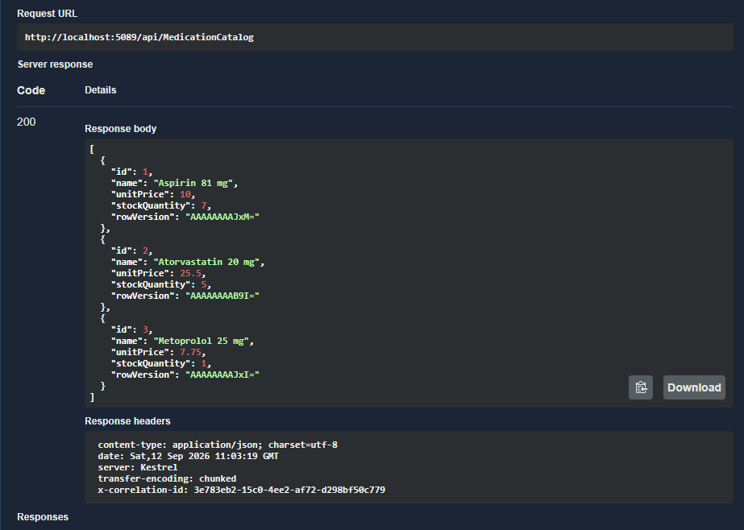

The terminal showed the SQL query against `MedicationCatalogItems`:

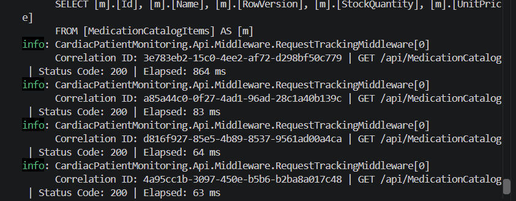

This confirmed that the first request was a cache miss.

---

# 7. Test 2 — GET: Cache Hit

I opened the same endpoint again:

`GET /api/MedicationCatalog`

### Steps

1. Opened the GET endpoint.
2. Used the Admin token.
3. Opened **Try it out**.
4. Executed the request.
5. Redis was checked.
6. The cached catalog was found.
7. The cached data was returned.
8. No new catalog SQL query was executed.

No request body was required.

### Result

The endpoint returned:

`200 OK`

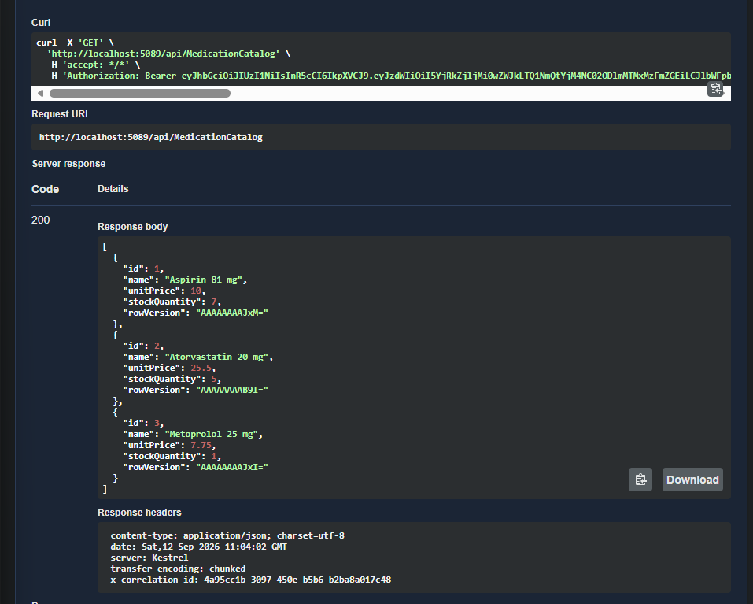

The terminal did not show another `MedicationCatalogItems` SQL query for the cache-hit request.

Observed times:

* Cache miss: **864 ms**
* Cache hit: **83 ms**
* Additional cache hit: **64 ms**
* Additional cache hit: **63 ms**

This confirmed that subsequent requests could use Redis instead of querying the catalog table again.

---

# 8. POST `/api/MedicationCatalog`

## What We Implemented

The POST endpoint creates a new `MedicationCatalogItem`.

The controller creates the entity from the request:

```csharp
var catalogItem = new MedicationCatalogItem
{
    Name = request.Name,
    UnitPrice = request.UnitPrice,
    StockQuantity = request.StockQuantity
};
```

After saving the item to SQL Server, the cache is invalidated:

```csharp
await _cache.RemoveAsync("medication-catalog:all");
```

---

# 9. Test 3 — POST: Create + Cache Invalidation

I opened:

`POST /api/MedicationCatalog`

in Swagger.

### Steps

1. Opened the POST endpoint.
2. Used the Admin token.
3. Opened **Try it out**.
4. Entered the request body:

```json
{
  "name": "Ibuprofen 200 mg",
  "unitPrice": 5,
  "stockQuantity": 10
}
```

5. Executed the request.
6. The item was inserted into SQL Server.
7. The catalog cache was removed.
8. The endpoint returned `201 Created`.

### Result

The created item received ID `4`.

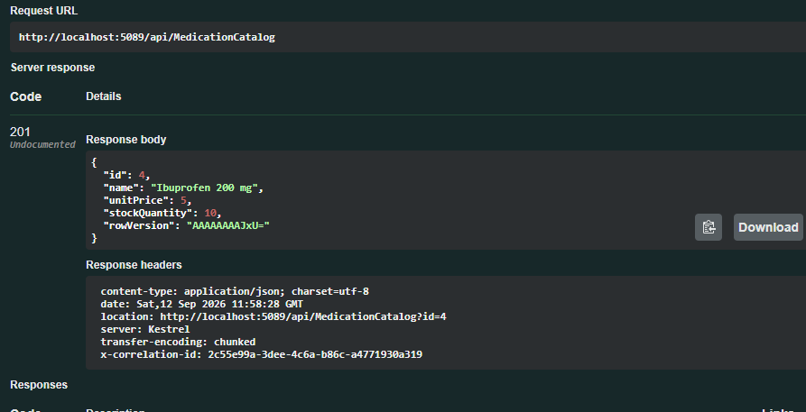

Then I opened:

`GET /api/MedicationCatalog`

and executed it again.

Because the cache had been invalidated, the GET queried SQL Server again.

The response included:

`Ibuprofen 200 mg`

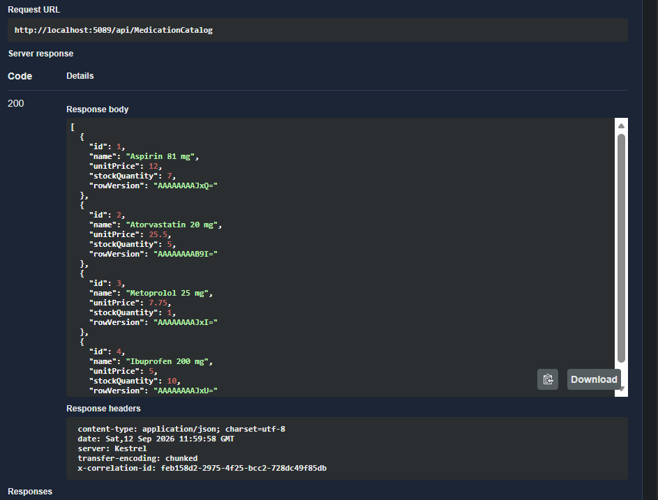

The terminal showed the INSERT followed by a new catalog SELECT:

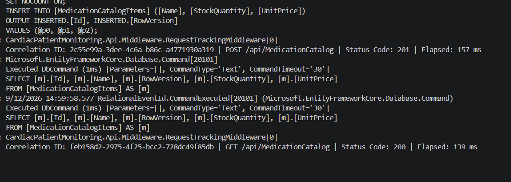

This confirmed that the POST operation invalidated the cached catalog.

---

# 10. PUT `/api/MedicationCatalog/{id}`

## What We Implemented

The PUT endpoint updates an existing catalog item.

The controller:

1. Loads the catalog item.
2. Checks the row version.
3. Updates the values.
4. Saves the changes.
5. Removes the catalog cache.

The cache invalidation is:

```csharp
await _cache.RemoveAsync("medication-catalog:all");
```

---

# 11. Test 4 — PUT: Update + Cache Invalidation

I opened:

`PUT /api/MedicationCatalog/{id}`

in Swagger.

The item being updated was:

`id = 1`

### Steps

1. Opened the PUT endpoint.
2. Used the Admin token.
3. Opened **Try it out**.
4. Entered `1` as the ID.
5. Entered the updated catalog data.
6. Included the current `RowVersion`.
7. Executed the request.
8. The API loaded the existing item.
9. The row version was checked.
10. The item was updated in SQL Server.
11. The catalog cache was removed.
12. The endpoint returned `200 OK`.

The price of Aspirin was changed from `10` to `12`.

Request body:

```json
{
  "name": "Aspirin 81 mg",
  "unitPrice": 12,
  "stockQuantity": 7,
  "rowVersion": "AAAAAAAAJxM="
}
```

### Result

The PUT returned:

`200 OK`

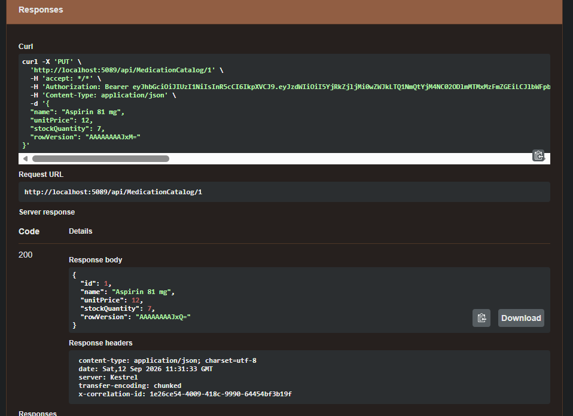

Then I opened:

`GET /api/MedicationCatalog`

and executed it again.

The updated Aspirin price was now:

`12`

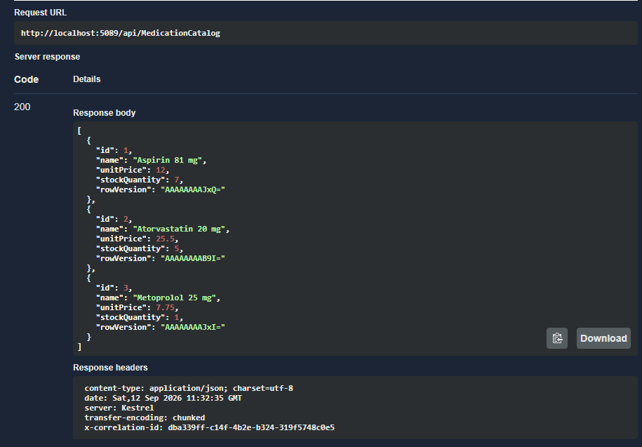

The terminal showed the UPDATE followed by a new catalog SELECT:

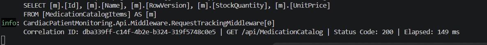

This confirmed that the old cached data had been removed.

---

# 12. DELETE `/api/MedicationCatalog/{id}`

## What We Implemented

The DELETE endpoint removes an existing catalog item.

After deleting the item from SQL Server, it removes:

```text
medication-catalog:all
```

from Redis.

---

# 13. Test 5 — DELETE: Delete + Cache Invalidation

I opened:

`DELETE /api/MedicationCatalog/{id}`

in Swagger.

The test item was:

`id = 4`

This was the `Ibuprofen 200 mg` item created in the POST test.

### Steps

1. Opened the DELETE endpoint.
2. Used the Admin token.
3. Opened **Try it out**.
4. Entered `4` as the ID.
5. Executed the request.
6. The item was deleted from SQL Server.
7. The catalog cache was removed.
8. The endpoint returned `204 No Content`.

No request body was required.

### Result

The endpoint returned:

`204 No Content`

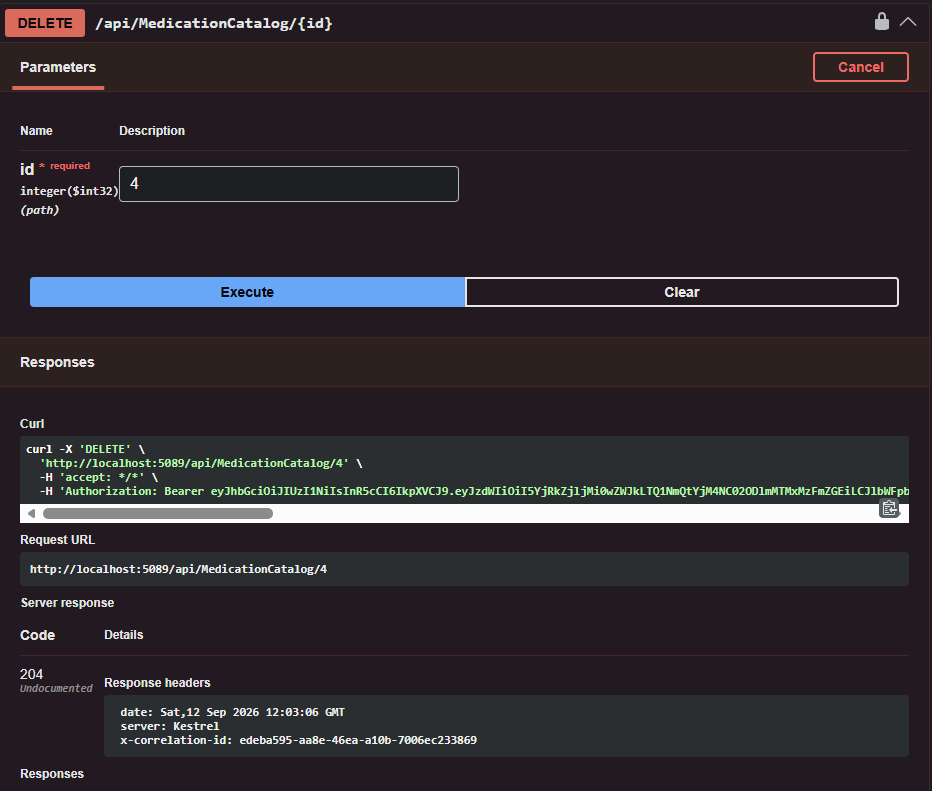

Then I opened:

`GET /api/MedicationCatalog`

and executed it again.

The catalog was loaded again from SQL Server because the cache had been invalidated.

`Ibuprofen 200 mg` was no longer present.

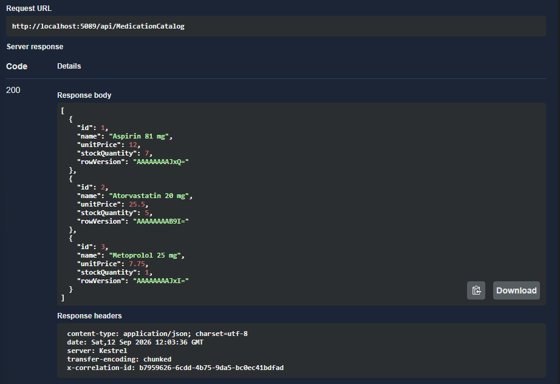

The terminal showed the DELETE followed by a new catalog SELECT:

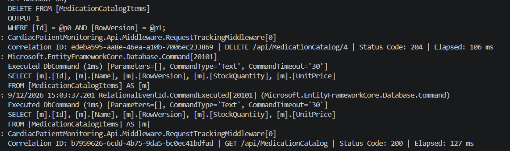

This confirmed that the DELETE operation also invalidated the cache.

---

# 14. Cache Performance Results

The observed timings were:

| Request            | Result                 | Approx. Time |
| ------------------ | ---------------------- | -----------: |
| First catalog GET  | Cache miss + SQL query |       864 ms |
| Second catalog GET | Cache hit              |        83 ms |
| Third catalog GET  | Cache hit              |        64 ms |
| Fourth catalog GET | Cache hit              |        63 ms |

The SQL logs provided additional evidence:

* Cache miss → catalog SQL query executed.
* Cache hit → no new `MedicationCatalogItems` query.

The exact response time can vary between requests, so the main evidence was the change in database access together with the observed lower response times for cache hits.

---

# 15. Cache Invalidation Summary

Every write operation explicitly invalidates the catalog cache.

| Endpoint | Result         | Cache Action          |
| -------- | -------------- | --------------------- |
| GET      | 200 OK         | Checks Redis first    |
| POST     | 201 Created    | Removes catalog cache |
| PUT      | 200 OK         | Removes catalog cache |
| DELETE   | 204 No Content | Removes catalog cache |

The cache also has a 10-minute expiration.

Expiration does not replace explicit invalidation.

---

# 16. Files Added or Modified

| File                                                                                                                                        | Purpose                                                   |
| ------------------------------------------------------------------------------------------------------------------------------------------- | --------------------------------------------------------- |
| [MedicationCatalogController.cs](./CardiacPatientMonitoring/CardiacPatientMonitoring.Api/Controllers/MedicationCatalogController.cs)        | Handles catalog CRUD, cache-aside, and cache invalidation |
| [CreateMedicationCatalogItemRequest.cs](./CardiacPatientMonitoring/CardiacPatientMonitoring.Api/DTOs/CreateMedicationCatalogItemRequest.cs) | Request model for creating catalog items                  |
| [UpdateMedicationCatalogItemRequest.cs](./CardiacPatientMonitoring/CardiacPatientMonitoring.Api/DTOs/UpdateMedicationCatalogItemRequest.cs) | Request model for updating catalog items                  |
| [MedicationCatalogValidators.cs](./CardiacPatientMonitoring/CardiacPatientMonitoring.Api/Validators/MedicationCatalogValidators.cs)         | Validates catalog requests                                |
| [Program.cs](./CardiacPatientMonitoring/CardiacPatientMonitoring.Api/Program.cs)                                                            | Registers Redis                                           |
| [CardiacPatientMonitoring.Api.csproj](./CardiacPatientMonitoring/CardiacPatientMonitoring.Api/CardiacPatientMonitoring.Api.csproj)          | Contains the Redis package                                |
| [MedicationCatalogItem.cs](./CardiacPatientMonitoring/CardiacPatientMonitoring.Api/Entities/MedicationCatalogItem.cs)                       | Existing catalog entity                                   |
| [CardiacPatientMonitoringDbContext.cs](./CardiacPatientMonitoring/CardiacPatientMonitoring.Api/Data/CardiacPatientMonitoringDbContext.cs)   | Existing catalog DbSet and database configuration         |

---

# 17. What I Learned

During Day 3, I learned:

* What Redis caching is.
* When caching is useful.
* How to identify a suitable cache candidate in an existing project.
* How to use `IDistributedCache`.
* How the cache-aside pattern works.
* How to serialize data before storing it in Redis.
* How to configure cache expiration.
* Why cache invalidation is required after writes.
* How to verify Redis behavior using SQL logging.
* How to compare cache miss and cache hit behavior.
* How to keep Redis credentials outside the source code using User Secrets.

---

# 18. Outcome

By the end of Day 3, Redis caching was implemented for the existing medication catalog.

The implementation now supports:

* Redis through `IDistributedCache`
* Cache-aside pattern
* 10-minute cache expiration
* Admin authorization
* Catalog GET
* Catalog POST
* Catalog PUT
* Catalog DELETE
* Explicit cache invalidation after writes
* SQL logging for verification
* Cache miss and cache hit measurements

The tests confirmed that the first catalog request queried SQL Server and populated Redis, subsequent requests could use the cached catalog, and catalog changes became visible immediately after the cache was invalidated.
